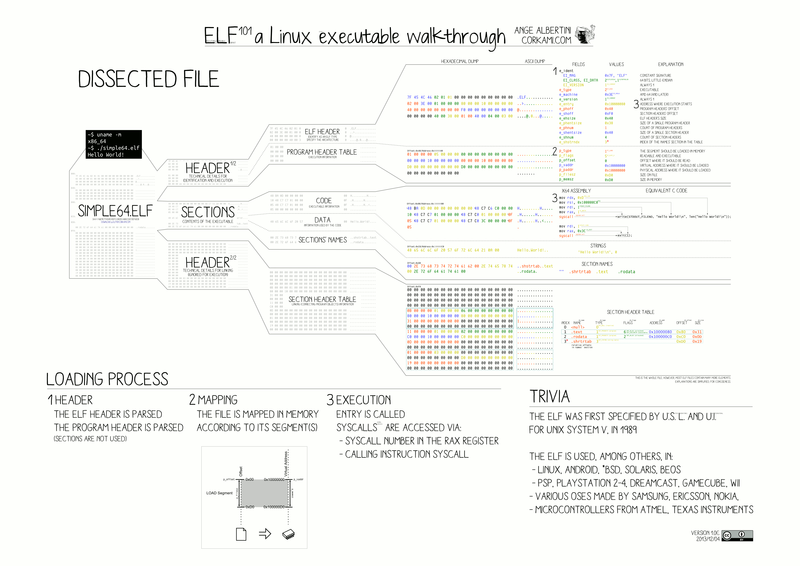
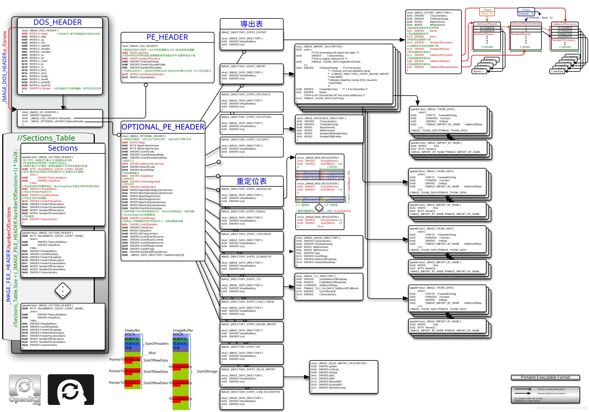
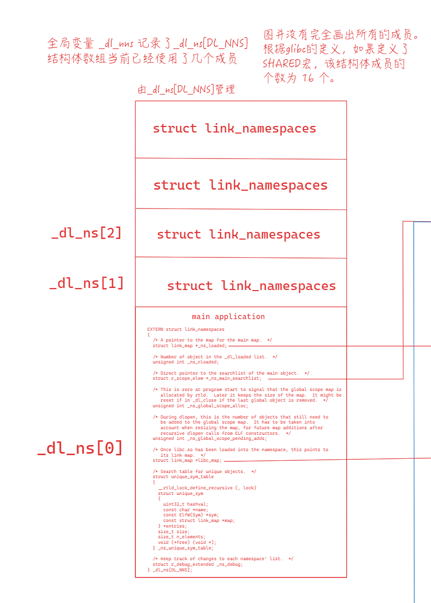
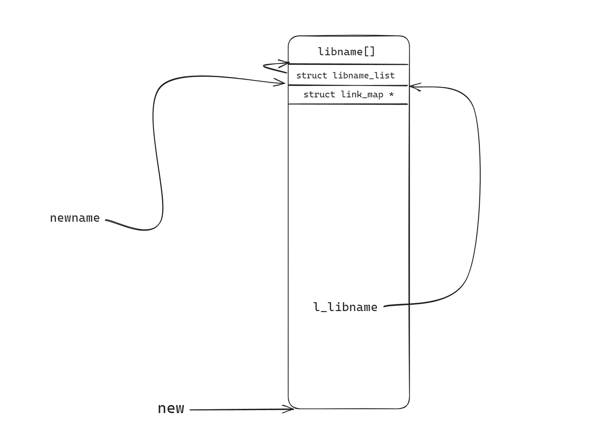
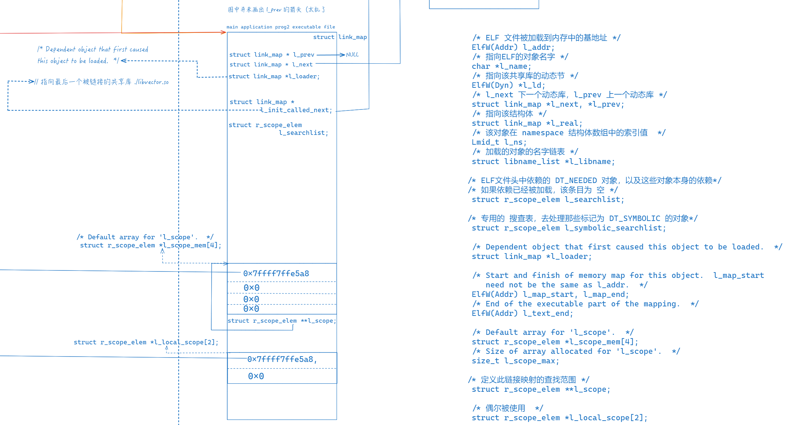
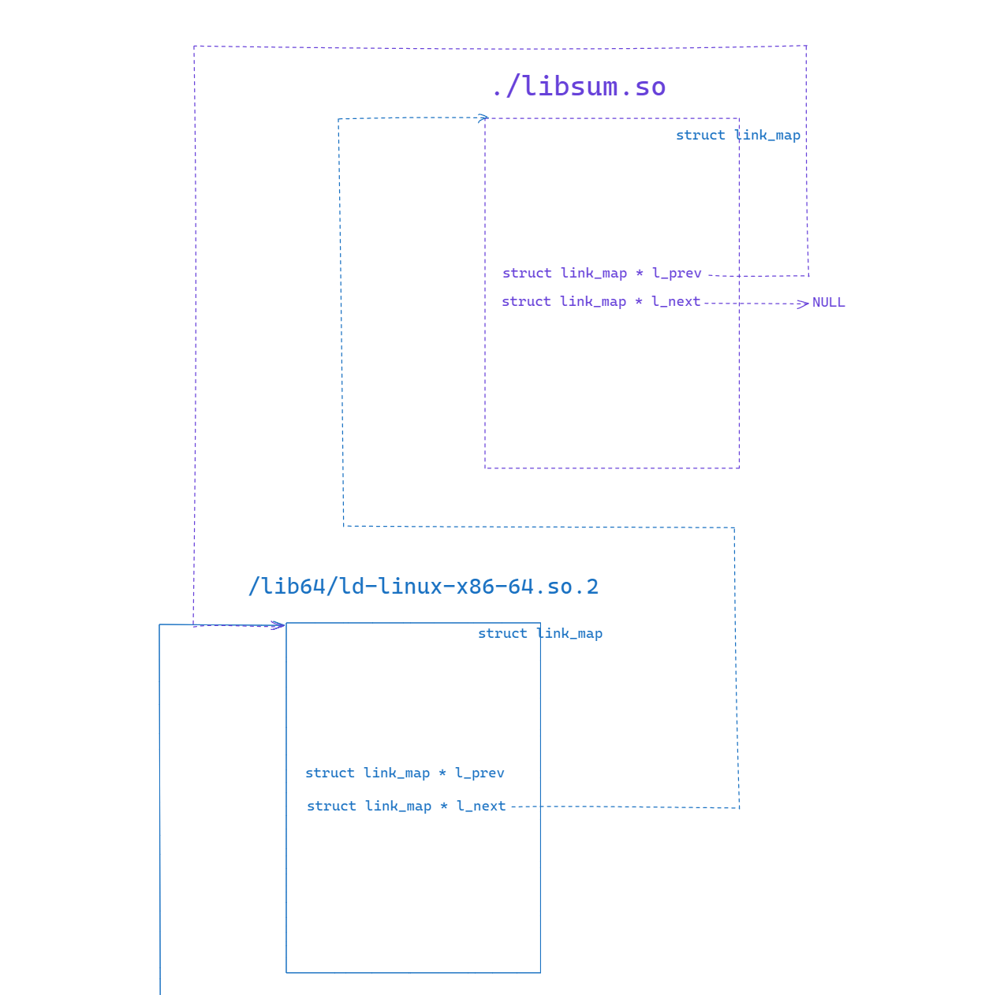

# 介绍链接与加载 

## 序言

介绍可执行文件的链接与加载。假设你有C语言基础。

本篇实验机器为`x86_64`架构的Linux系统，所使用的`Glibc`库版本为`2.37`。所用到的调试工具为`pwndbg`，该工具是`gdb`的一个插件，该插件非常方便。反汇编程序的时候再也不用去看`AT&T`格式汇编了(虽然我对这个风格没什么意见，不过大多数平时接触的还是Intel风格汇编)，值得一提的是，该插件也兼容一小部分WinDbg命令，比如最常用的`e*`, `d*`和`bp`等。

`src`文件夹包含了本篇所用到的全部源代码: `main.c`, `vector.h`, `addvec.c`, `multvec.c`, `sum.c` 和 `main2.c`。

## 基础部分

### 编译过程

**本节用到了`main.c`，`vector.h`，`addvec.c`，`multvec.c`和`sum.c`文件，您可以在`src`文件夹中找到它们。**

main.c包含了 vector.h 文件，改头文件提供了两个函数声明。addvec.c 和 multvec.c 实现了这两个函数。main.c引用了 sum.c 文件的函数。


使用下面这条命令来编译这些文件，可以使用 `-v` 选项来查看编译详情。

```bash
gcc -Og -o prog main.c sum.c multvec.c addvec.c
```

gcc 主要使用了4个工具`cpp`, `ccl`, `as` 和 `ld`。

首先 C预处理器(C preprocessor)，被称为cpp，是一个宏处理器，再C编译器编译程序之前，它会自动的展开源代码的宏，以及将include文件添加进来。它只能被用来处理C，C++，和Objective-C源码文件。

```bash
cpp main.c main.i && cpp sum.c sum.i && cpp addvec.c addvec.i && cpp multvec.c multvec.i
```

所以 `main.i` 的文件内容就变成了如下这样：

```c
# 0 "main.c"
# 0 "<built-in>"
# 0 "<command-line>"
# 1 "/usr/include/stdc-predef.h" 1 3 4
# 0 "<command-line>" 2
# 1 "main.c"
# 1 "vector.h" 1
void addvec(int *x, int *y, int *z, int n);
void multvec(int *x, int *y, int *z, int n);
# 2 "main.c" 2


int sum(int *a, int n);
int x[2] = {1, 2};
int y[2] = {3, 4};
int z[2];
long bss;

int main(){
 addvec(x, y, z, 2);
 bss = sum(z, 2);
 return bss;
}
```

接下来，C编译器(ccl)将main.i翻译成一个汇编文件 main.s 对其他文件也一样。

```bash
ccl main.i -Og -o main.s && ccl sum.i -Og -o sum.s && ccl addvec.i -Og -o addvec.s && ccl multvec.i -Og -o multvec.s 
```

`ccl` 是一个gcc内部的命令，它接受一个经过预处理器的C语言文件，然后将他们转换成汇编代码文件。它只能用来编译C语言，对于其他语言则有不同的内部命令。比如对于C++语言，GCC使用 cclplus 命令。
可以使用如下的命令来查看gcc的一些内部命令

```bash
linux> tree -if /usr/libexec/gcc
/usr/libexec/gcc
/usr/libexec/gcc/x86_64-linux-gnu
/usr/libexec/gcc/x86_64-linux-gnu/13
/usr/libexec/gcc/x86_64-linux-gnu/13/cc1
/usr/libexec/gcc/x86_64-linux-gnu/13/cc1plus
/usr/libexec/gcc/x86_64-linux-gnu/13/collect2
/usr/libexec/gcc/x86_64-linux-gnu/13/g++-mapper-server
/usr/libexec/gcc/x86_64-linux-gnu/13/liblto_plugin.so
/usr/libexec/gcc/x86_64-linux-gnu/13/lto1
/usr/libexec/gcc/x86_64-linux-gnu/13/lto-wrapper
```

接着 汇编器(as)会将汇编文件翻译成一个**可重定位**目标文件。

```
as -o main.o main.s && as -o sum.o sum.s && as -o addvec.o addvec.s && as -o multvec.o multvec.s  
```

可以使用 objdump 工具来查看这些文件的内容。

```
linux> objdump -d main.o

main.o:     file format elf64-x86-64


Disassembly of section .text:

0000000000000000 <main>:
   0:   53                      push   %rbx
   1:   b9 02 00 00 00          mov    $0x2,%ecx
   6:   48 8d 1d 00 00 00 00    lea    0x0(%rip),%rbx        # d <main+0xd>
   d:   48 89 da                mov    %rbx,%rdx
  10:   48 8d 35 00 00 00 00    lea    0x0(%rip),%rsi        # 17 <main+0x17>
  17:   48 8d 3d 00 00 00 00    lea    0x0(%rip),%rdi        # 1e <main+0x1e>
  1e:   e8 00 00 00 00          call   23 <main+0x23>
  23:   be 02 00 00 00          mov    $0x2,%esi
  28:   48 89 df                mov    %rbx,%rdi
  2b:   e8 00 00 00 00          call   30 <main+0x30>
  30:   48 63 d0                movslq %eax,%rdx
  33:   48 89 15 00 00 00 00    mov    %rdx,0x0(%rip)        # 3a <main+0x3a>
  3a:   5b                      pop    %rbx
  3b:   c3                      ret
```

对于一些需要跳转的指令，比如`call`指令，`1e:   e8 00 00 00 00          call   23 <main+0x23>`，可以看到它的操作数为 `00 00 00 00`。这些二进制文件并不能被执行，需要链接器填入这些地址。

```
> ld -o prog main.o sum.o addvec.o multvec.o
ld: warning: cannot find entry symbol _start; defaulting to 0000000000401000
```

接着，链接器程序`ld`将`main.o`, `sum.o`, `addvec.o`, `multvec.o`以及一些必要的系统目标文件 (比如crti.o,crtbegin.o, crtend.o crtn.o等一些在执行main之前执行的代码的可重定位文件，以及一些运行时需要的库，比如C标准库，这些暂时不深入探讨，可以看下面的链接 **How Initialization Functions Are Handled** ) 组合起来，创建一个可执行的目标文件 prog。可以看到ld抛出来一条警告，这是因为在链接过程中需要添加前面介绍过的`crti.o`,`crtbegin.o`等一些必要的可重定位目标文件。

当执行该文件的时候，操作系统会调用一个叫做加载器(loader)的函数(比如Linux系统库里面的 execve 函数)。将可执行文件的代码和数据复制到内存，然后跳转到程序的入口地址。

在明白上面这个过程后，让我们来研究一下gcc的 `-v` 选项。`-v`选项告诉gcc输出详细的编译过程，我们使用下面这句命令来查看输出：
```
linux> gcc -v -Og -o prog main.c sum.c multvec.c addvec.c 
```
首先是第一部分：
```
Using built-in specs.
COLLECT_GCC=gcc
COLLECT_LTO_WRAPPER=/usr/libexec/gcc/x86_64-linux-gnu/13/lto-wrapper
OFFLOAD_TARGET_NAMES=nvptx-none:amdgcn-amdhsa
OFFLOAD_TARGET_DEFAULT=1
Target: x86_64-linux-gnu
Configured with: ../src/configure -v --with-pkgversion='Debian 13.2.0-7' --with-bugurl=file:///usr/share/doc/gcc-13/README.Bugs --enable-languages=c,ada,c++,go,d,fortran,objc,obj-c++,m2 --prefix=/usr --with-gcc-major-version-only --program-suffix=-13 --program-prefix=x86_64-linux-gnu- --enable-shared --enable-linker-build-id --libexecdir=/usr/libexec --without-included-gettext --enable-threads=posix --libdir=/usr/lib --enable-nls --enable-bootstrap --enable-clocale=gnu --enable-libstdcxx-debug --enable-libstdcxx-time=yes --with-default-libstdcxx-abi=new --enable-gnu-unique-object --disable-vtable-verify --enable-plugin --enable-default-pie --with-system-zlib --enable-libphobos-checking=release --with-target-system-zlib=auto --enable-objc-gc=auto --enable-multiarch --disable-werror --enable-cet --with-arch-32=i686 --with-abi=m64 --with-multilib-list=m32,m64,mx32 --enable-multilib --with-tune=generic --enable-offload-targets=nvptx-none=/build/reproducible-path/gcc-13-13.2.0/debian/tmp-nvptx/usr,amdgcn-amdhsa=/build/reproducible-path/gcc-13-13.2.0/debian/tmp-gcn/usr --enable-offload-defaulted --without-cuda-driver --enable-checking=release --build=x86_64-linux-gnu --host=x86_64-linux-gnu --target=x86_64-linux-gnu --with-build-config=bootstrap-lto-lean --enable-link-serialization=3
Thread model: posix
Supported LTO compression algorithms: zlib zstd
gcc version 13.2.0 (Debian 13.2.0-7) 
```
第一部分显示了当前gcc的详细信息，比如构建的目标架构`x86_64-linux-gnu`，构建选项`Configured with`的内容，线程模型`Thread model`等一些信息。

下面是第二部分：
```
COLLECT_GCC_OPTIONS='-v' '-Og' '-o' 'prog' '-mtune=generic' '-march=x86-64' '-dumpdir' 'prog-'
 /usr/libexec/gcc/x86_64-linux-gnu/13/cc1 -quiet -v -imultiarch x86_64-linux-gnu main.c -quiet -dumpdir prog- -dumpbase main.c -dumpbase-ext .c -mtune=generic -march=x86-64 -Og -version -fasynchronous-unwind-tables -o /tmp/ccl5hwKR.s
GNU C17 (Debian 13.2.0-7) version 13.2.0 (x86_64-linux-gnu)
        compiled by GNU C version 13.2.0, GMP version 6.3.0, MPFR version 4.2.1, MPC version 1.3.1, isl version isl-0.26-GMP
```
`-dumpdir prog-`选项告诉gcc，使用`prog-`文件夹存放编译过程中产生的临时文件和辅助文件。gcc使用ccl程序将我们输入的第一个源文件main.c编译为`ccl5hwKR.s`，并存放在临时文件夹里。

接下来三部分的行为类似：
```
GGC heuristics: --param ggc-min-expand=100 --param ggc-min-heapsize=131072
ignoring nonexistent directory "/usr/local/include/x86_64-linux-gnu"
ignoring nonexistent directory "/usr/lib/gcc/x86_64-linux-gnu/13/include-fixed/x86_64-linux-gnu"
ignoring nonexistent directory "/usr/lib/gcc/x86_64-linux-gnu/13/include-fixed"
ignoring nonexistent directory "/usr/lib/gcc/x86_64-linux-gnu/13/../../../../x86_64-linux-gnu/include"
#include "..." search starts here:
#include <...> search starts here:
 /usr/lib/gcc/x86_64-linux-gnu/13/include
 /usr/local/include
 /usr/include/x86_64-linux-gnu
 /usr/include
End of search list.
Compiler executable checksum: 703503d3cc8534b91d53f31f2f813204
COLLECT_GCC_OPTIONS='-v' '-Og' '-o' 'prog' '-mtune=generic' '-march=x86-64' '-dumpdir' 'prog-'
 as -v --64 -o /tmp/cc0mohgi.o /tmp/ccl5hwKR.s
GNU assembler version 2.41.90 (x86_64-linux-gnu) using BFD version (GNU Binutils for Debian) 2.41.90.20240115
COLLECT_GCC_OPTIONS='-v' '-Og' '-o' 'prog' '-mtune=generic' '-march=x86-64' '-dumpdir' 'prog-'
 /usr/libexec/gcc/x86_64-linux-gnu/13/cc1 -quiet -v -imultiarch x86_64-linux-gnu sum.c -quiet -dumpdir prog- -dumpbase sum.c -dumpbase-ext .c -mtune=generic -march=x86-64 -Og -version -fasynchronous-unwind-tables -o /tmp/ccl5hwKR.s
GNU C17 (Debian 13.2.0-7) version 13.2.0 (x86_64-linux-gnu)
        compiled by GNU C version 13.2.0, GMP version 6.3.0, MPFR version 4.2.1, MPC version 1.3.1, isl version isl-0.26-GMP
```
```
GGC heuristics: --param ggc-min-expand=100 --param ggc-min-heapsize=131072
ignoring nonexistent directory "/usr/local/include/x86_64-linux-gnu"
ignoring nonexistent directory "/usr/lib/gcc/x86_64-linux-gnu/13/include-fixed/x86_64-linux-gnu"
ignoring nonexistent directory "/usr/lib/gcc/x86_64-linux-gnu/13/include-fixed"
ignoring nonexistent directory "/usr/lib/gcc/x86_64-linux-gnu/13/../../../../x86_64-linux-gnu/include"
#include "..." search starts here:
#include <...> search starts here:
 /usr/lib/gcc/x86_64-linux-gnu/13/include
 /usr/local/include
 /usr/include/x86_64-linux-gnu
 /usr/include
End of search list.
Compiler executable checksum: 703503d3cc8534b91d53f31f2f813204
COLLECT_GCC_OPTIONS='-v' '-Og' '-o' 'prog' '-mtune=generic' '-march=x86-64' '-dumpdir' 'prog-'
 as -v --64 -o /tmp/ccT316qm.o /tmp/ccl5hwKR.s
GNU assembler version 2.41.90 (x86_64-linux-gnu) using BFD version (GNU Binutils for Debian) 2.41.90.20240115
COLLECT_GCC_OPTIONS='-v' '-Og' '-o' 'prog' '-mtune=generic' '-march=x86-64' '-dumpdir' 'prog-'
 /usr/libexec/gcc/x86_64-linux-gnu/13/cc1 -quiet -v -imultiarch x86_64-linux-gnu multvec.c -quiet -dumpdir prog- -dumpbase multvec.c -dumpbase-ext .c -mtune=generic -march=x86-64 -Og -version -fasynchronous-unwind-tables -o /tmp/ccl5hwKR.s
GNU C17 (Debian 13.2.0-7) version 13.2.0 (x86_64-linux-gnu)
        compiled by GNU C version 13.2.0, GMP version 6.3.0, MPFR version 4.2.1, MPC version 1.3.1, isl version isl-0.26-GMP
```
```
GGC heuristics: --param ggc-min-expand=100 --param ggc-min-heapsize=131072
ignoring nonexistent directory "/usr/local/include/x86_64-linux-gnu"
ignoring nonexistent directory "/usr/lib/gcc/x86_64-linux-gnu/13/include-fixed/x86_64-linux-gnu"
ignoring nonexistent directory "/usr/lib/gcc/x86_64-linux-gnu/13/include-fixed"
ignoring nonexistent directory "/usr/lib/gcc/x86_64-linux-gnu/13/../../../../x86_64-linux-gnu/include"
#include "..." search starts here:
#include <...> search starts here:
 /usr/lib/gcc/x86_64-linux-gnu/13/include
 /usr/local/include
 /usr/include/x86_64-linux-gnu
 /usr/include
End of search list.
Compiler executable checksum: 703503d3cc8534b91d53f31f2f813204
COLLECT_GCC_OPTIONS='-v' '-Og' '-o' 'prog' '-mtune=generic' '-march=x86-64' '-dumpdir' 'prog-'
 as -v --64 -o /tmp/ccsjVhIT.o /tmp/ccl5hwKR.s
GNU assembler version 2.41.90 (x86_64-linux-gnu) using BFD version (GNU Binutils for Debian) 2.41.90.20240115
COLLECT_GCC_OPTIONS='-v' '-Og' '-o' 'prog' '-mtune=generic' '-march=x86-64' '-dumpdir' 'prog-'
 /usr/libexec/gcc/x86_64-linux-gnu/13/cc1 -quiet -v -imultiarch x86_64-linux-gnu addvec.c -quiet -dumpdir prog- -dumpbase addvec.c -dumpbase-ext .c -mtune=generic -march=x86-64 -Og -version -fasynchronous-unwind-tables -o /tmp/ccl5hwKR.s
GNU C17 (Debian 13.2.0-7) version 13.2.0 (x86_64-linux-gnu)
        compiled by GNU C version 13.2.0, GMP version 6.3.0, MPFR version 4.2.1, MPC version 1.3.1, isl version isl-0.26-GMP
```
gcc使用ccl编译器分别将`sum.c`, `multvec.c` 和 `addvec.c` 编译为 `ccl5hwKR.s` 文件，然后使用汇编器将它们汇编为可重定位目标文件`cc0mohgi.o`, `ccT316qm.o` 和 `ccsjVhIT.o`。

最后一部分是这样的：
```
GGC heuristics: --param ggc-min-expand=100 --param ggc-min-heapsize=131072
ignoring nonexistent directory "/usr/local/include/x86_64-linux-gnu"
ignoring nonexistent directory "/usr/lib/gcc/x86_64-linux-gnu/13/include-fixed/x86_64-linux-gnu"
ignoring nonexistent directory "/usr/lib/gcc/x86_64-linux-gnu/13/include-fixed"
ignoring nonexistent directory "/usr/lib/gcc/x86_64-linux-gnu/13/../../../../x86_64-linux-gnu/include"
#include "..." search starts here:
#include <...> search starts here:
 /usr/lib/gcc/x86_64-linux-gnu/13/include
 /usr/local/include
 /usr/include/x86_64-linux-gnu
 /usr/include
End of search list.
Compiler executable checksum: 703503d3cc8534b91d53f31f2f813204
COLLECT_GCC_OPTIONS='-v' '-Og' '-o' 'prog' '-mtune=generic' '-march=x86-64' '-dumpdir' 'prog-'
 as -v --64 -o /tmp/ccHcnfMO.o /tmp/ccl5hwKR.s
GNU assembler version 2.41.90 (x86_64-linux-gnu) using BFD version (GNU Binutils for Debian) 2.41.90.20240115
COMPILER_PATH=/usr/libexec/gcc/x86_64-linux-gnu/13/:/usr/libexec/gcc/x86_64-linux-gnu/13/:/usr/libexec/gcc/x86_64-linux-gnu/:/usr/lib/gcc/x86_64-linux-gnu/13/:/usr/lib/gcc/x86_64-linux-gnu/
LIBRARY_PATH=/usr/lib/gcc/x86_64-linux-gnu/13/:/usr/lib/gcc/x86_64-linux-gnu/13/../../../x86_64-linux-gnu/:/usr/lib/gcc/x86_64-linux-gnu/13/../../../../lib/:/lib/x86_64-linux-gnu/:/lib/../lib/:/usr/lib/x86_64-linux-gnu/:/usr/lib/../lib/:/usr/lib/gcc/x86_64-linux-gnu/13/../../../:/lib/:/usr/lib/
COLLECT_GCC_OPTIONS='-v' '-Og' '-o' 'prog' '-mtune=generic' '-march=x86-64' '-dumpdir' 'prog.'
 /usr/libexec/gcc/x86_64-linux-gnu/13/collect2 -plugin /usr/libexec/gcc/x86_64-linux-gnu/13/liblto_plugin.so -plugin-opt=/usr/libexec/gcc/x86_64-linux-gnu/13/lto-wrapper -plugin-opt=-fresolution=/tmp/ccFUMMrw.res -plugin-opt=-pass-through=-lgcc -plugin-opt=-pass-through=-lgcc_s -plugin-opt=-pass-through=-lc -plugin-opt=-pass-through=-lgcc -plugin-opt=-pass-through=-lgcc_s --build-id --eh-frame-hdr -m elf_x86_64 --hash-style=gnu --as-needed -dynamic-linker /lib64/ld-linux-x86-64.so.2 -pie -o prog /usr/lib/gcc/x86_64-linux-gnu/13/../../../x86_64-linux-gnu/Scrt1.o /usr/lib/gcc/x86_64-linux-gnu/13/../../../x86_64-linux-gnu/crti.o /usr/lib/gcc/x86_64-linux-gnu/13/crtbeginS.o -L/usr/lib/gcc/x86_64-linux-gnu/13 -L/usr/lib/gcc/x86_64-linux-gnu/13/../../../x86_64-linux-gnu -L/usr/lib/gcc/x86_64-linux-gnu/13/../../../../lib -L/lib/x86_64-linux-gnu -L/lib/../lib -L/usr/lib/x86_64-linux-gnu -L/usr/lib/../lib -L/usr/lib/gcc/x86_64-linux-gnu/13/../../.. /tmp/cc0mohgi.o /tmp/ccT316qm.o /tmp/ccsjVhIT.o /tmp/ccHcnfMO.o -lgcc --push-state --as-needed -lgcc_s --pop-state -lc -lgcc --push-state --as-needed -lgcc_s --pop-state /usr/lib/gcc/x86_64-linux-gnu/13/crtendS.o /usr/lib/gcc/x86_64-linux-gnu/13/../../../x86_64-linux-gnu/crtn.o
COLLECT_GCC_OPTIONS='-v' '-Og' '-o' 'prog' '-mtune=generic' '-march=x86-64' '-dumpdir' 'prog.'
```
在最后一部分我们可以看到这行输出`as -v --64 -o /tmp/ccHcnfMO.o /tmp/ccl5hwKR.s`。此时汇编器使用的`ccl5hwKR.s`汇编代码文件是第二部分`ccl`程序编译`main.c`(编译时输入的第一个源代码文件)源代码文件产生的汇编代码文件。这个操作让我感到很迷惑，实际上，我们输入的第一个C源代码文件`main.c`是最后一个被汇编成为可重定位目标文件的。

接着，我们看到gcc使用了一个`collect2`的程序，该程序是gcc用来在开始链接时整理各种初始化函数。它用来在初次链接程序时，在链接器的输出中查找标识函数名字为构造函数的符号，它将创建一个临时的`.c`文件，该文件包含了这些函数的一张表，然后编译该文件，并在第二次链接的过程中加入新编译的可重定位目标文件，并链接到目标程序(示例中是prog程序)。

回到`collect2`程序，我们看到了该程序使用了许多参数, 我们仅关注一部分选项。其中`-m`选项指定了目标文件的架构，这里我们看到为`-m elf_x86_64`, `--hash-style=gnu`选项指定使用gnu的hash风格，`.gnu_hash`节与该选项有关，简单来讲就是GNU使用了布隆过滤器来存储函数的信息。对于一个函数符号，GNU会对该函数名字进行多个不同的hash运算，并将这些hash结果存储在布隆过滤器中，当程序需要根据函数的名称来获得函数的地址时(比如dlsym函数，或者延迟绑定技术)，GNU会对函数名字进行hash运算，以此来判断需要查找的函数是否存在。需要注意的是，由于布隆过滤器的特性，当传入一个函数名称字符串时，GNU只能通过该机制判断该函数一定不存在，或者该函数可能存在。还有一个选项是`-dynamic-linker /lib64/ld-linux-x86_64.so.2`，该选项是gcc用来指定要使用的动态链接器，它是一个链接器程序，用来加载共享库，或者修复符号引用。`-pie` 选项指定使用`Position Independent Executable(PIE)`技术，在最后一节详细讨论该技术。接下来gcc会调用链接器程序，按照顺序链接它们，最终形成`prog`可执行目标文件。

下面展示了链接时的顺序：
1. /usr/lib/gcc/x86_64-linux-gnu/13/../../../x86_64-linux-gnu/Scrt1.o 
2. /usr/lib/gcc/x86_64-linux-gnu/13/../../../x86_64-linux-gnu/crti.o 
3. /usr/lib/gcc/x86_64-linux-gnu/13/crtbeginS.o 
4. -L/usr/lib/gcc/x86_64-linux-gnu/13 
5. -L/usr/lib/gcc/x86_64-linux-gnu/13/../../../x86_64-linux-gnu 
6. -L/usr/lib/gcc/x86_64-linux-gnu/13/../../../../lib 
7. -L/lib/x86_64-linux-gnu -L/lib/../lib 
8. -L/usr/lib/x86_64-linux-gnu 
9. -L/usr/lib/../lib 
10. -L/usr/lib/gcc/x86_64-linux-gnu/13/../../.. 
11. /tmp/cc0mohgi.o 
12. /tmp/ccT316qm.o 
13. /tmp/ccsjVhIT.o 
14. /tmp/ccHcnfMO.o 
15. -lgcc --push-state --as-needed -lgcc_s --pop-state -lc -lgcc --push-state --as-needed -lgcc_s --pop-state 
16. /usr/lib/gcc/x86_64-linux-gnu/13/crtendS.o 
17. /usr/lib/gcc/x86_64-linux-gnu/13/../../../x86_64-linux-gnu/crtn.o

最开始的三个文件和最后的两个文件是gcc提供的，可以看到它们按照一一对应的顺序被连接到程序中，链接器按照crti.o, crtbeginS.o顺序链接，而在最后按照ctrendS.o crtn.o的顺序收尾。
`-L` 选项告诉gcc在这些路径下搜索头文件。
接着是由我们源代码被编译出的可重定位目标文件，它们按照sum.c multvec.c addvec.c main.c 的顺序被添加到链接器的参数中。回顾一下我们的命令`gcc -v -Og -o prog main.c sum.c multvec.c addvec.c`，我们可以看到我们输入的第一个参数main.c是最后一个被链接的，而main.c后面的文件是按照顺序依次被添加到链接器的输入参数中。
`-lgcc`, `-lgcc_s` 和 `-lc` 选项告诉gcc使用libgcc, libgcc_s 和 libc 库。
最后添加`crtendS.o`和`crtn.o`文件。
当链接器执行完毕，我们就得到了我们的可执行目标文件`prog`，在命令行上输入下面这条命令即可执行我们刚得到的文件：
```
linux> ./prog
```

### 二进制文件


操作系统支持两种基本的文件类型，文本文件(以文本形式读取信息)与可执行二进制文件(当做可执行文件加载到内存中执行)。

一种比较早的可执行文件格式为COFF(Common Object File Format)。这是UNIX(AT&T UNIX SystemV)中引入的用于描述二进制目标文件的格式规范。尽管 COFF 为目标文件定义了一个很好的框架，比如以前的 a.out 格式改进了很多，但它仍然有一些限制，比如文件中段(section)的数量有最大限制，段的名称也有长度限制，无法支持像 C++语言所需要的符号化调试信息等。因此，每一个采用 COFP 的操作系统厂商几乎都或多或少地对其进行了扩展，Windows的 PE(Portable Executable) 格式扩展了 COFF，AT&T自己又在COFF基础上定义了 ELF (Extensible Linking Format)，ELF 目前被广泛用于各种UNIX 类操作系统，包括 Linux 和 FreeBSD; IBM在AIX中使用 XCOFF; 而Microsoft 则在COFF 格式规范基础上定义了PE 格式。在 Windows 平台上，可执行文件(扩展名为.exe)、目标文件(扩展名为.obj)、动态链接库(扩展名为.dll)以及设备驱动程序(扩展名为.sys)等多种文件类型使用了PE 文件格式。随着 64 位系统的到来，PE文件格式也相应地有了一个扩展的版本，称为 PE32+，允许使用 64 位地址空间。

下面是两张图详细展示了ELF文件与PE文件的结构：





可以看到，无论是ELF或者PE，它们有着类似的设计。头, 节表 和 节。

**头**

头用来存储该文件的一些基本信息，比如 魔术码，版本号，类型，入口地址(非常重要)等。操作系统的加载器需要读取头的信息，根据头的信息来确定如何加载该文件，如何执行该文件。

可以使用readelf工具来查看ELF文件的头，Windows的PE可以使用`CFF Explorer`等其他工具。

```
> readelf --headers prog
ELF Header:
  Magic:   7f 45 4c 46 02 01 01 00 00 00 00 00 00 00 00 00 
  Class:                             ELF64
  Data:                              2's complement, little endian
  Version:                           1 (current)
  OS/ABI:                            UNIX - System V
  ABI Version:                       0
  Type:                              DYN (Position-Independent Executable file)
  Machine:                           Advanced Micro Devices X86-64
  Version:                           0x1
  Entry point address:               0x1040
  Start of program headers:          64 (bytes into file)
  Start of section headers:          14280 (bytes into file)
  Flags:                             0x0
  Size of this header:               64 (bytes)
  Size of program headers:           56 (bytes)
  Number of program headers:         13
  Size of section headers:           64 (bytes)
  Number of section headers:         30
  Section header string table index: 29

  ......

```

可以看到`Entry point address`的值为 0x1040，该值加上程序映射在内存中的基地址就是程序的起始位置。接下来，我将使用gdb来验证这个过程。
```
> gdb prog
pwndbg> info files
Symbols from "/root/sources/prog".
Native process:
        Using the running image of child Thread 0x7ffff7dc7740 (LWP 1685).
        While running this, GDB does not access memory from...
Local exec file:
        `/root/sources/prog', file type elf64-x86-64.
        Entry point: 0x555555555040
```
0x555555555040 - 0x1040 就是该可执行文件被映射到内存中的位置 0x555555554000。后文会介绍一个非常重要的结构体`struct link_map`，该结构体中的一个`l_addr`存储的地址就是关联的对象(也就是示例中的prog)映射到内存中的位置。

可以使用gdb的bt命令来查看进程的调用栈
```
pwndbg> bt
#0  0x0000555555555129 in main ()
#1  0x00007ffff7df16ca in __libc_start_call_main (main=main@entry=0x555555555129 <main>, argc=argc@entry=1, argv=argv@entry=0x7fffffffe2d8) at ../sysdeps/nptl/libc_start_call_main.h:58
#2  0x00007ffff7df1785 in __libc_start_main_impl (main=0x555555555129 <main>, argc=1, argv=0x7fffffffe2d8, init=<optimized out>, fini=<optimized out>, rtld_fini=<optimized out>, 
    stack_end=0x7fffffffe2c8) at ../csu/libc-start.c:360
#3  0x0000555555555061 in _start ()
```
程序的入口地址其实为 _start，也就是0x555555555040，也正对应了之前看到的链接错误，`warning: cannot find entry symbol _start`。

```
pwndbg> disass _start
Dump of assembler code for function _start:
   0x0000555555555040 <+0>:     xor    ebp,ebp
```
当程序被映射到内存中，将要执行的第一条指令的位置就是0x0000555555555040。

**节表**

节表描述了该文件的节的信息。包括节的名字，比如：'.text', '.data'等，节的类型，偏移地址，和 标志等。下面展示了一个可执行文件的一些节的作用：
- `.text`：已编译程序的机器代码。
- `.rodata`：只读数据。比如C代码`char * sz = "hello, world\n";`，`"hello, world\n`就存放在该节中。
- `.data`：已初始化的全局和静态C变量.局部C变量在运行时被保存在栈中，既不出现在.data节中，也不出现在.bss节中.
- `.bss`：未初始化的全局和静态C变量，以及所有被初始化为0的全局或静态变量。在目标文件中这个节不占据实际的空间，它仅仅是一个占位符.目标文件格式区分已初始化和未初始化变量是为了空间效率:在目标文件中，未初始化变量不需要占据任何实际的磁盘空间.运行时，在内存中分配这些变量，初始值为0.
- `.symtab`：一个符号表，它存放在程序中定义和引用的函数和全局变量的信息.一些程序员错误地认为必须通过-g选项来编译一个程序，才能得到符号表信息.实际上，每个可重定位目标文件在符号中都有一张符号表(除非程序员特意用条命令去掉(它)。然而，和编译器中的符号表不同，.symtab符号表不包含局部变量的条目.
- `.rel.text`：一个.text节中位置的列表，当链接器把这个目标文件和其他文件组合时，需要修改这些位置.一般而言，任何调用外部函数或者引用全局变量的指令都需要修改.另一方面，调用本地函数的指令则不需要修改.注意，可执行目标文件中并不需要重定位信息，因此通常省略，除非用户显式地指示链接器包含这些信息.
- `.rel.data`：被模块引用或定义的所有全局变量的重定位信息.一般而言，任何已初始化的全局变量，如果它的初始值是一个全局变量地址或者外部定义函数的地址，都需要被修改.
- `.debug`：一个调试符号表，其条目是程序中定义的局部变量和类型定义，程序中定义和引用的全局变量，以及原始的 C 源文件。只有以-g 选项调用编译器驱动程序时，才会得到这张表。
- `.line`：原始 C源程序中的行号和.text 节中机器指令之间的映射。只有以-g 选项调用编译器驱动程序时，才会得到这张表。
- `.strtab`：一个字符串表，其内容包括.symtab 和.debug 节中的符号表，以及节头部中的节名字。字符串表就是以 nul1 结尾的字符串的序列。

每个节的属性由他们的标志位决定，下面展示了ELF的几种标志类型。
```
Key to Flags:
  W (write), A (alloc), X (execute), M (merge), S (strings), I (info),
  L (link order), O (extra OS processing required), G (group), T (TLS),
  C (compressed), x (unknown), o (OS specific), E (exclude),
  D (mbind), l (large), p (processor specific)
```
在分析可执行文件时千万不要仅查看节的名字来确定节的用途，需要根据节的标志位来猜测节的作用。
可以使用下面的命令来查看一个文件的节表：

一个最基本的程序是由 数据 和 代码 组成的。数据区域可以被读，写，但不能被执行。代码区域可以被读，执行，但不能被随意写入。一些Web业务的漏洞就是没有对数据进行严格的过滤，或者采用了非常糟糕的"黑名单"策略，导致 骇客 可以构造一些特殊的数据，让Web应用程序执行这些被精心构造的数据从而导致敏感信息被窃取。所以，Web业务设计的最基本原则就是 "数据与代码分离"，或者采用"白名单"策略，这些名单应该被严格筛选。同样，二进制安全的一些漏洞也是类似的原理。

```
> readelf --section-headers prog
There are 30 section headers, starting at offset 0x37c8:

Section Headers:
  [Nr] Name              Type             Address           Offset
       Size              EntSize          Flags  Link  Info  Align
  [ 0]                   NULL             0000000000000000  00000000
       0000000000000000  0000000000000000           0     0     0
  ......
  [14] .text             PROGBITS         0000000000001040  00001040
       000000000000018c  0000000000000000  AX       0     0     16
  ......
  [24] .data             PROGBITS         0000000000004000  00003000
       0000000000000020  0000000000000000  WA       0     0     8  
  ......
```

可以看到 .text节可以被执行，但不能被写入。而.data只能被写入。

**节**

节是程序真正的数据，加载器(比如Linux的 execve 函数)，会根据节表给出的信息，将节加载到内存中，可以使用gdb的`info files`命令查看当前可执行文件的节被加载到了什么地方。
```
pwndbg> info files
Symbols from "/root/sources/prog".
Native process:
        Using the running image of child Thread 0x7ffff7dc7740 (LWP 4715).
        While running this, GDB does not access memory from...
Local exec file:
        `/root/sources/prog', file type elf64-x86-64.
        Entry point: 0x555555555040
        0x0000555555554318 - 0x0000555555554334 is .interp
        0x0000555555554338 - 0x0000555555554358 is .note.gnu.property
        0x0000555555554358 - 0x000055555555437c is .note.gnu.build-id
        0x000055555555437c - 0x000055555555439c is .note.ABI-tag
        0x00005555555543a0 - 0x00005555555543c4 is .gnu.hash
        0x00005555555543c8 - 0x0000555555554458 is .dynsym
        0x0000555555554458 - 0x00005555555544e0 is .dynstr
        0x00005555555544e0 - 0x00005555555544ec is .gnu.version
        0x00005555555544f0 - 0x0000555555554520 is .gnu.version_r
        0x0000555555554520 - 0x00005555555545e0 is .rela.dyn
        0x0000555555555000 - 0x0000555555555017 is .init
        0x0000555555555020 - 0x0000555555555030 is .plt
        0x0000555555555030 - 0x0000555555555038 is .plt.got
        0x0000555555555040 - 0x00005555555551cc is .text
        0x00005555555551cc - 0x00005555555551d5 is .fini
        0x0000555555556000 - 0x0000555555556004 is .rodata
        0x0000555555556004 - 0x0000555555556048 is .eh_frame_hdr
        0x0000555555556048 - 0x0000555555556138 is .eh_frame
        0x0000555555557e00 - 0x0000555555557e08 is .init_array
        0x0000555555557e08 - 0x0000555555557e10 is .fini_array
        0x0000555555557e10 - 0x0000555555557fc0 is .dynamic
        0x0000555555557fc0 - 0x0000555555557fe8 is .got
        0x0000555555557fe8 - 0x0000555555558000 is .got.plt
        0x0000555555558000 - 0x0000555555558020 is .data
        0x0000555555558020 - 0x0000555555558040 is .bss
        ......
```
可以看到，`.text`节被加载到了 `0x0000555555555040 - 0x00005555555551cc` 的地方。

### 符号解析

每个可重定位目标模块都有一张符号表`.symtab`，，它包含当前模块定义和引用的符号的信息。在链接器上下文中，有三种不同的符号：
- 由当前模块定义并能被其他模块引用的全局符号，全局链接器符号对于**非静态的C函数和全局变量**。
- 由其他模块中定义的并被当前模块引用的全局符号。这些符号也被称为外部符号，对应于其他模块中定义的非静态C函数和全局变量。
- 只被当前模块定义和引用的局部符号。它们对应于带static属性的C函数和全局变量。这些符号在当前模块中任何位置都可见，但是不能被其他模块引用。

目标文件的符号表包含定位和重定位程序的符号定义和符号引用所需的信息。符号表索引是此数组的下标。索引 0 指定表中的第一项并用作未定义的符号索引。

```c
typedef struct {
        Elf64_Word      st_name;
        unsigned char   st_info;
        unsigned char   st_other;
        Elf64_Half      st_shndx;
        Elf64_Addr      st_value;
        Elf64_Xword     st_size;
} Elf64_Sym;
```

在输入文件处理期间，输入可重定位目标文件中的所有局部符号都将传递到输出文件映像。输入可重定位目标文件的所有全局符号以及共享目标文件依赖项的所有全局符号都在链接编辑器内部累积。

可以在此内部符号表中搜索输入文件提供的每个全局符号。如果遇到与上一个输入文件中名称相同的符号，则将调用符号解析过程。此符号解析过程决定保留可重定位目标文件两项中的哪一项。此解析过程还会决定共享目标文件依赖项外部引用的建立方式。

完成输入文件处理后，如果没有发生符号解析致命错误，链接编辑器会决定是否保留任何未解析的符号引用。未解析的符号引用可能导致链接编辑终止。

最后，将链接编辑器的内部符号表添加到要创建的映像的符号表中。

在符号解析阶段，链接器从左到右按照它们在在命令行出现的顺寻来扫描可重定位目标文件和库。

### 重定位


## 进阶部分

接下来重新编译我们的示例

```bash
gcc -shared -fpic -o libsum.so sum.c && 
gcc -shared -fpic -o libvector.so addvec.c multvec.c &&
gcc -Og -g -z lazy -pie -fno-stack-protector -o prog2 main2.c ./libvector.so
```

- `-shared` 选项告诉gcc我们需要编译一个共享库。
- `-fpic` 选项指定强制使用位置无关代码(Position-Independent Code (PIC))。
- `-z lazy` 选项告诉我们的可执行文件强制使用延迟绑定。
- `-fno-stack-protector` 选项告诉gcc禁用栈保护，这个选项无关紧要，不过如果你不想让.got节出现其他信息的话，可以选择开启这个选项。

可执行文件，动态链接库他们的区别并不是很大。Linux使用了一种 `link_map` 的结构体来存储它们的信息，并通过一个全局的_dl_ns结构体数组来管理进程的已加载的对象(Windows上称为 '模块')的信息。理解的这些结构体的作用就能很容易的明白Linux是如何管理这些对象的，不幸的是，这些结构体比较复杂，本节并不会非常详细的介绍每个结构体的每个成员，只会将精力放在相对比较重要的成员上，当然啦，如果有兴趣，您可以下载glibc的源码自己分析。本文档使用的是 glibc 2.38 版本。

link_map 结构体定义: [struct link_map](https://codebrowser.dev/glibc/glibc/include/link.h.html#link_map)
在`./glibc/include/link.h`文件中同样可以找到 link_map 结构体的定义。

### dlopen源码分析

这是一张非常重要的图(自己画的，如果有误及时联系我更正，仓库也给出了图层源文件，可以自己修改导出)，GNU/Linux管理对象的逻辑基本上如下图所示(还有很多细节，不过碍于本人水平，时间等其他因素，只能做到这里了。)


下面展示了`dlopen`函数原型

```c
void *
___dlopen (const char *file, int mode)
{
  return __dlopen (file, mode, RETURN_ADDRESS (0));
}
```

`RETURN_ADDRESS (0) `实际上是我们main函数调用`dlopen`函数的指令的下一条指令的地址。

```c
/* Determine the return address.  */
#define RETURN_ADDRESS(nr) \
  __builtin_extract_return_addr (__builtin_return_address (nr))
```

它传入调用者函数地址，然后调用了`__dlopen`函数

```c
void *
__dlopen (const char *file, int mode, void *dl_caller)
{
  return dlopen_implementation (file, mode, dl_caller);
}
```

继续调用 `dlopen_implementation`

```c
struct dlopen_args
{
  /* The arguments for dlopen_doit.  */
  const char *file;
  int mode;
  /* The return value of dlopen_doit.  */
  void *new;
  /* Address of the caller.  */
  const void *caller;
};

static void *
dlopen_implementation (const char *file, int mode, void *dl_caller)
{
  struct dlopen_args args;
  args.file = file;
  args.mode = mode;
  args.caller = dl_caller;
  return _dlerror_run (dlopen_doit, &args) ? NULL : args.new;
}
```

它调用`_dlerror_run`，并传入了 `dlopen_doit` 和 `args`的地址作为参数，然后调用`GLRO(dl_catch_error)`, 接着调用`__GI__dl_catch_exception`。对于本节课的目的，我们可以忽略`_dlerror_run`函数，同样的，还有`_dl_catch_error`，`__GI__dl_catch_exception`还有将会遇到的其他类似的函数，我们同样进行忽略，下面再次遇到类似的函数就不再过多赘述了。

```c
int
_dlerror_run (void (*operate) (void *), void *args){
  // ......
  int errcode = GLRO (dl_catch_error) (&objname, &errstring, &malloced,
                       operate, args);
  // ......
}
```

接着，来到了 `dlopen_doit`

```c
static void
dlopen_doit (void *a)
{
  struct dlopen_args *args = (struct dlopen_args *) a;
  if (args->mode & ~(RTLD_BINDING_MASK | RTLD_NOLOAD | RTLD_DEEPBIND
             | RTLD_GLOBAL | RTLD_LOCAL | RTLD_NODELETE
             | __RTLD_SPROF))
    _dl_signal_error (0, NULL, NULL, _("invalid mode parameter"));
  args->new = GLRO(dl_open) (args->file ?: "", args->mode | __RTLD_DLOPEN,
                 args->caller,
                 args->file == NULL ? LM_ID_BASE : NS,
                 __libc_argc, __libc_argv, __environ);
}
```

传入的变量`a`指针记录了一些信息供后面的函数使用。

```
{
  // 指向目标库名字的指针
  file = 0x555555556004 "./libsum.so",
  // mode RTLD_LAZY
  mode = 1,
  // 应该指向新link_map对象的地址，不过我不知道为什么会指向.got.plt节的 y 区段
  new = 0x555555558030 <y>,
  // 调用dlopen函数的下一条指令的地址
  caller = 0x5555555551a2 <main+57>
}
```

下面展示了 `.got.plt` 节的内容，不过我也不明白，不过不影响后面的分析。

```
0x555555557fe8: 0x0000000000003dd0
0x555555557ff0: 0x00007ffff7ffe2d0
0x555555557ff8: 0x00007ffff7fdd300
0x555555558000 <addvec@got.plt>:        0x00007ffff7fbf0f9
0x555555558008 <dlopen@got.plt>:        0x00007ffff7e49740
0x555555558010 <dlsym@got.plt>: 0x0000555555555056
0x555555558018 <dlclose@got.plt>:       0x0000555555555066
0x555555558020: 0x0000000000000000
0x555555558028: 0x0000555555558028
0x555555558030 <y>:     0x0000000400000003
0x555555558038 <x>:     0x0000000200000001
0x555555558040 <completed.0>:   0x0000000000000000
0x555555558048 <plusd>: 0x0000000000000000
0x555555558050 <z>:     0x0000000600000004
0x555555558058: 0x0000000000000000
0x555555558060: 0x0000000000000000
```

其中

```c
/* Internally used flag.  */
#define __RTLD_DLOPEN    0x80000000
```

可以看到它进行了简单的错误判断之后就调用了`_dl_open`函数。

```c
// 原型
void *
_dl_open (const char *file, int mode, const void *caller_dlopen, Lmid_t nsid,
      int argc, char *argv[], char *env[])
//  传入_dl_open 的参数
/*  _dl_open (file=0x555555556004 "./libsum.so", mode=-2147483647,
    caller_dlopen=0x5555555551a2 <main+57>, nsid=-2, argc=1, 
    argv=0x7fffffffe2b8, env=0x7fffffffe2c8) at ./elf/dl-open.c:825
*/
```

下面展示了 `_dl_open`函数的开头部分。

```c
  if ((mode & RTLD_BINDING_MASK) == 0)
    /* One of the flags must be set.  */
    _dl_signal_error (EINVAL, file, NULL, N_("invalid mode for dlopen()"));
  // ......
  if (__glibc_unlikely (nsid == LM_ID_NEWLM))
  {
    /* Find a new namespace.  */
    for (nsid = 1; DL_NNS > 1 && nsid < GL(dl_nns); ++nsid)
      if (GL(dl_ns)[nsid]._ns_loaded == NULL)
        break;
    if (__glibc_unlikely (nsid == DL_NNS))
    {
      /* No more namespace available.  */
      __rtld_lock_unlock_recursive (GL(dl_load_lock));
      _dl_signal_error (EINVAL, file, NULL, N_("\
no more namespaces available for dlmopen()"));
    }
    else if (nsid == GL(dl_nns))
    {
      __rtld_lock_initialize (GL(dl_ns)[nsid]._ns_unique_sym_table.lock);
      ++GL(dl_nns);
    }
      GL(dl_ns)[nsid].libc_map = NULL;
      _dl_debug_update (nsid)->r_state = RT_CONSISTENT;
  }

  // ......
```

可以看到glibc内部做了非常多的错误处理，来保证函数可以正常的运行。虽然在调试过程中我们并不会进入这个分支，不过还是需要提一点东西。

值得注意的是 `GL(dl_nns)`，该宏的定义如下：

```c
# define GL(name) _##name
```

所以`GL(dl_nns) `其实就是 `_dl_nns`，它是一个全局变量，用来决定 `struct link_namespace` 结构体数组的大小。该错误处理为`nsid`寻找一个新的namespace位置，如果`nsid == DL_NNS`，出现错误，结束函数。如果 `nsid == _dl_nns`，就把_dl_nns值+1。
再获得一个新的namespace位置后，就对该结构体初始化。

```c
/* Non-shared code has no support for multiple namespaces.  */
#ifdef SHARED
# define DL_NNS 16
#else
# define DL_NNS 1
#endif
```

```c
GL(dl_ns)[nsid].libc_map = NULL;
```



这段看不懂没关系，只是先留个印象，由于 `struct link_namespace` 结构体比较复杂，现在只是先留个印象。等看到后面自然就明白了。

```c
struct dl_open_args args;
args.file = file;
args.mode = mode;
args.caller_dlopen = caller_dlopen;
args.map = NULL;
args.nsid = nsid;
/* args.libc_already_loaded is always assigned by dl_open_worker
    (before any explicit/non-local returns).  */
args.argc = argc;
args.argv = argv;
args.env = env;
// ......
int errcode = _dl_catch_exception (&exception, dl_open_worker, &args);
// ......
```

```c
struct dl_open_args
{
  const char *file;
  int mode;
  /* This is the caller of the dlopen() function.  */
  const void *caller_dlopen;
  struct link_map *map;
  /* Namespace ID.  */
  Lmid_t nsid;
  /* Original value of _ns_global_scope_pending_adds.  Set by
     dl_open_worker.  Only valid if nsid is a real namespace
     (non-negative).  */
  unsigned int original_global_scope_pending_adds;
  /* Set to true by dl_open_worker if libc.so was already loaded into
     the namespace at the time dl_open_worker was called.  This is
     used to determine whether libc.so early initialization has
     already been done before, and whether to roll back the cached
     libc_map value in the namespace in case of a dlopen failure.  */
  bool libc_already_loaded;
  /* Set to true if the end of dl_open_worker_begin was reached.  */
  bool worker_continue;
  /* Original parameters to the program and the current environment.  */
  int argc;
  char **argv;
  char **env;
};
```

在 `_dl_open` 中，新建了一个 `struct dl_open_args` 结构体对象 `args`，然后为这个对象赋值，接着调用 `dl_open_work`继续处理。args这个对象同样非常重要，需要关注的是 `Lmid_t nsid` 和 将指向 `libsum.so` 对象的 link_map 结构体指针 map。

```c
// /* Type for namespace indices.  */
// typedef long int Lmid_t;

struct link_map *map;
/* Namespace ID.  */
Lmid_t nsid;
```

现在，该来到 `dl_open_work` 函数了。

```c
static void
dl_open_worker (void *a)

// ......
  struct dl_open_args *args = a;
  args->worker_continue = false;
  {
    /* Protects global and module specific TLS state.  */
    __rtld_lock_lock_recursive (GL(dl_load_tls_lock));
    struct dl_exception ex;
    int err = _dl_catch_exception (&ex, dl_open_worker_begin, args);
    __rtld_lock_unlock_recursive (GL(dl_load_tls_lock));
    if (__glibc_unlikely (ex.errstring != NULL))
      /* Reraise the error.  */
      _dl_signal_exception (err, &ex, NULL);
  }
  if (!args->worker_continue)
    return;

// ......
```

这段代码写的直戳了当，设置`dl_open_args::worker_contine`的成员为 false，调用 `dl_open_worker_begin` 如果 `dl_open_worker_begin` 的工作并未做完就返回，那么同样直接返回 `dl_open_work`函数。

先来看下 `dl_open_worker_begin` 的定义

```c
static void
dl_open_worker_begin (void *a)
```

```c
  /* Determine the caller's map if necessary.  This is needed in case
     we have a DST, when we don't know the namespace ID we have to put
     the new object in, or when the file name has no path in which
     case we need to look along the RUNPATH/RPATH of the caller.  */
  const char *dst = strchr (file, '$');
  if (dst != NULL || args->nsid == __LM_ID_CALLER
      || strchr (file, '/') == NULL)
    {
      const void *caller_dlopen = args->caller_dlopen;
      /* We have to find out from which object the caller is calling.
     By default we assume this is the main application.  */
      call_map = GL(dl_ns)[LM_ID_BASE]._ns_loaded;
      struct link_map *l = _dl_find_dso_for_object ((ElfW(Addr)) caller_dlopen);
      if (l)
    call_map = l;
      if (args->nsid == __LM_ID_CALLER)
    args->nsid = call_map->l_ns;
    }
```

这段代码注释说的比较详细，将call_map指针指向main程序(也就是我们运行的prog2)的`struct link_map` 结构体的信息。

```c
_dl_find_dso_for_object (const ElfW(Addr) addr)
{
  struct link_map *l;
  /* Find the highest-addressed object that ADDR is not below.  */
  for (Lmid_t ns = 0; ns < GL(dl_nns); ++ns)
    for (l = GL(dl_ns)[ns]._ns_loaded; l != NULL; l = l->l_next)
      if (addr >= l->l_map_start && addr < l->l_map_end
      && (l->l_contiguous
          || _dl_addr_inside_object (l, (ElfW(Addr)) addr)))
    {
      assert (ns == l->l_ns);
      return l;
    }
  return NULL;
}
```

该函数遍历`_dl_ns`结构体数组，然后将传入的参数 `caller_open`(**也就是我们prog2程序main函数调用dlopen的下一条指令**)的地址与映射到内存的对象的起始地址与结束地址进行比对，然后返回匹配成功的对象。

```c
struct link_map{
    // ......
    /* Start and finish of memory map for this object.  l_map_start
       need not be the same as l_addr.  */
    ElfW(Addr) l_map_start, l_map_end;
    // ......
    unsigned int l_contiguous:1; /* Nonzero if inter-segment holes are
        mprotected or if no holes are present at
        all.  */
    // ......
}
```

`(l->l_contiguous || _dl_addr_inside_object (l, (ElfW(Addr)) addr)))` 这段代码进行进一步的检查，感兴趣的可以查看 `glibc/elf/dl-addr-obj.c` 文件，glibc对这里的介绍非常详细。

由于传入的`args->nsid == __LM_ID_CALLER`，所以该条件成立。将 `call_map->l_ns` 赋值给 `args->nsid == 0`。其实就是将main程序在 namespace 的索引赋值给 args->nsid。

```c
  /* The namespace ID is now known.  Keep track of whether libc.so was
     already loaded, to determine whether it is necessary to call the
     early initialization routine (or clear libc_map on error).  */
  args->libc_already_loaded = GL(dl_ns)[args->nsid].libc_map != NULL;
```

如果libc对象被加载，就设置args->libc_already_loaded为1。

```c
  /* Retain the old value, so that it can be restored.  */
  args->original_global_scope_pending_adds
    = GL (dl_ns)[args->nsid]._ns_global_scope_pending_adds;
```

可以看下 `struct link_namespace`的注释，不再赘述
下面展示了此时 args 的信息。

```
{
  指向 "libm.so.6" 字符串
  file = 0x555555556004,
  open 参数
  mode = 0x80000001,
  调用dlopen函数的下一条指令
  caller_dlopen = 0x55555555517b,
  目标对象
  map = 0x0,
  main模块在 全局namespaces 的索引
  nsid = 0x0,

  original_global_scope_pending_adds = 0x0,
  libc_already_loaded = 0x1,
  worker_continue = 0x0,
  argc = 0x1,
  argv = 0x7fffffffe2b8,
  env = 0x7fffffffe2c8
}
```

加载对象。

```c
/* Load the named object.  */
struct link_map *new;
args->map = new = _dl_map_object (call_map, file, lt_loaded, 0,
          mode | __RTLD_CALLMAP, args->nsid);
```

在 `_dl_map_object` 中
首先将 `l` 指向当前的 main 模块，然后遍历 `struct link_map` 链表，查看目标模块是否已经被加载，找到就返回。对于我们的示例，当然是没找到。

```c
  /* Look for this name among those already loaded.  */
  for (l = GL(dl_ns)[nsid]._ns_loaded; l; l = l->l_next)
    {
      /* If the requested name matches the soname of a loaded object,
     use that object.  Elide this check for names that have not
     yet been opened.  */
      if (__glibc_unlikely ((l->l_faked | l->l_removed) != 0))
    continue;
      if (!_dl_name_match_p (name, l))
    {
      const char *soname;
      if (__glibc_likely (l->l_soname_added)
          || l->l_info[DT_SONAME] == NULL)
        continue;
      soname = ((const char *) D_PTR (l, l_info[DT_STRTAB])
            + l->l_info[DT_SONAME]->d_un.d_val);
      if (strcmp (name, soname) != 0)
        continue;
      /* We have a match on a new name -- cache it.  */
      add_name_to_object (l, soname);
      l->l_soname_added = 1;
    }
      /* We have a match.  */
      return l;
    }
```

调整模块名字，不再赘述，这部分可以自己去阅读源码

```c
  /* Give the auditing libraries a chance to change the name before we
     try anything.  */
  /* 此处省略 几百行 */
```

判断是否在其他路径，或者是否在ld缓存，不再赘述。

调用 `_dl_new_object`，为目标模块分配一个新的对象。下面展示了调用`_dl_new_object` 函数时传入的参数：

```
_dl_new_object (realname=realname@entry=0x5555555592a0 "./libsum.so", 
    libname=libname@entry=0x555555556004 "./libsum.so", type=type@entry=2, loader=loader@entry=0x0, 
    mode=mode@entry=-1879048191, nsid=nsid@entry=0) at ./elf/dl-object.c:62
```

```c
  new = (struct link_map *) calloc (sizeof (*new) + audit_space
                    + sizeof (struct link_map *)
                    + sizeof (*newname) + libname_len, 1);
  if (new == NULL)
    return NULL;
  new->l_real = new;
  new->l_symbolic_searchlist.r_list = (struct link_map **) ((char *) (new + 1)
                                + audit_space);
  new->l_libname = newname
    = (struct libname_list *) (new->l_symbolic_searchlist.r_list + 1);
  newname->name = (char *) memcpy (newname + 1, libname, libname_len);
  /* newname->next = NULL;    We use calloc therefore not necessary.  */
  newname->dont_free = 1;
```

```c
#ifdef SHARED
  size_t audit_space = naudit * sizeof (struct auditstate);
#else
# define audit_space 0
#endif
```

```c
/* Information used by audit modules.  For most link maps, this data
   immediate follows the link map in memory.  For the dynamic linker,
   it is allocated separately.  See link_map_audit_state in
   <ldsodefs.h>.  */
struct auditstate
{
  uintptr_t cookie;
  unsigned int bindflags;
};
```

在该函数中，首先为 `struct link_map * new` 申请一块内存，这块内存的大小为 `sizeof(struct link_map)` 用来存储 libsum.so DSO的信息，audit_space虽然不为0，但是我们可以暂时忽略它，所以先不考虑。还分配了一个指向 `struct link_map *` 结构体的指针的大小的内存， `new->l_symbolic_searchlist.r_list` 指向了该地址。`new->l_libname` 跟 `newname` 都指向 新分配的 `struct libname_list`, 该结构体的字符串指针(**libname_list::name**)指向最后分配的那一小块内存。

```c
/* A data structure for a simple single linked list of strings.  */
struct libname_list
  {
    const char *name;        /* Name requested (before search).  */
    struct libname_list *next;    /* Link to next name for this object.  */
    int dont_free;        /* Flag whether this element should be freed
                   if the object is not entirely unloaded.  */
  };
```

下面这个矩形展示了新申请的内存，new->l_libname 和 newname 都指向一个 `struct libname_list`结构体，其中该结构体中的 `libname_list::name` 成员指向`libname[]`



接着

```c
  /* 让l_scope默认使用 l_scope_mem 数组，如果需要更多的条目就动态地申请更大的数组 */
  new->l_scope = new->l_scope_mem;
  new->l_scope_max = sizeof (new->l_scope_mem) / sizeof (new->l_scope_mem[0]);
  /* Counter for the scopes we have to handle.  */
  int idx = 0;
  if (GL(dl_ns)[nsid]._ns_loaded != NULL)
    /* Add the global scope.  */
    // 将我们需要加载的 libsum.so 对象的 l_scope 的第一个成员指向我们prog2程序的
    // DT_NEEDED 列表，也就是 prog2 的 link_map::l_searchlist 地址
    new->l_scope[idx++] = &GL(dl_ns)[nsid]._ns_loaded->l_searchlist;

  /* If we have no loader the new object acts as it.  */
  if (loader == NULL)
    loader = new;
  else
    /* Determine the local scope.  */
    while (loader->l_loader != NULL)
      loader = loader->l_loader;
  /* Insert the scope if it isn't the global scope we already added.  */
  if (idx == 0 || &loader->l_searchlist != new->l_scope[0])
  {
      if ((mode & RTLD_DEEPBIND) != 0 && idx != 0)
      {
        new->l_scope[1] = new->l_scope[0];
        idx = 0;
      }
      new->l_scope[idx] = &loader->l_searchlist;
  }
  new->l_local_scope[0] = &new->l_searchlist;
```

上面这段代码有点绕。
因为我们传入的loader是0x0，所以该对象的loader指向它自己。

如果同时将mode设置 RTLD_DEEPBIND，就会把全局的l_scope的第二个成员(**指向r_scope_elem结构体的指针**)同样设置为第一个成员的值。

将第一个成员的值指向该link_map对象的DT_NEEDED搜查表。并同样初始化l_local_scope成员。

关于这些成员的作用，可以简单看下这个图：



后面代码对于我们的目的不是很重要，有兴趣可以看注释。

```c
      /* Signal that this is a faked entry.  */
      l->l_faked = 1;
      /* Since the descriptor is initialized with zero we do not
         have do this here.
      l->l_reserved = 0; */
      l->l_buckets = &dummy_bucket;
      l->l_nbuckets = 1;
      l->l_relocated = 1;
      /* Enter the object in the object list.  */
      _dl_add_to_namespace_list (l, nsid);
      return l;
```

接着返回新建的struct link_map对象，继续做了一些初始化的工作，接着`_dl_map_object` 函数又调用了 `_dl_add_to_namespace_list`

```c
/* Add the new link_map NEW to the end of the namespace list.  */
void
_dl_add_to_namespace_list (struct link_map *new, Lmid_t nsid)
{
  /* We modify the list of loaded objects.  */
  __rtld_lock_lock_recursive (GL(dl_load_write_lock));
  if (GL(dl_ns)[nsid]._ns_loaded != NULL)
    {
      struct link_map *l = GL(dl_ns)[nsid]._ns_loaded;
      while (l->l_next != NULL)
    l = l->l_next;
      new->l_prev = l;
      /* new->l_next = NULL;   Would be necessary but we use calloc.  */
      l->l_next = new;
    }
  else
    GL(dl_ns)[nsid]._ns_loaded = new;
  ++GL(dl_ns)[nsid]._ns_nloaded;
  new->l_serial = GL(dl_load_adds);

  ++GL(dl_load_adds);

  __rtld_lock_unlock_recursive (GL(dl_load_write_lock));
}
```

该函数比较简单，就是查找在全局变量`_dl_ns` 的结构体中查找我们的运行文件 prog2 的 link_map，将新建的libsum.so库的信息添加到该链表的末尾。如果指向prog2对象的link_map指针为 NULL，就把本来属于 prog2 的位置替换成当前运行的库的对象的link_map位置。将全局变量 _dl_ns中存储的 prog2 的信息中的 _ns_nloaded 结果 + 1。



后面就不说了，该函数返回，退回到 dl_open_worker_begin

```c
  /* This object is directly loaded.  */
  ++new->l_direct_opencount;
```

之后该函数又会做两个事情，加载该对象的依赖，接着进行重定位

```c
void
_dl_relocate_object (struct link_map *l, struct r_scope_elem *scope[],
             int reloc_mode, int consider_profiling)
{
  // 省略一大堆

  /* In case we can protect the data now that the relocations are
     done, do it.  */
  if (l->l_relro_size != 0)
  // 真正进行重定位的工作
    _dl_protect_relro (l);
}
```

然后就回到 `dl_open_work`了

```
新struct link_map 结构体的部分内容如下所示
  l_addr = 0x7ffff7fb9000,
  l_name = 0x5555555592a0,
  l_ld = 0x7ffff7fbce78,
  l_next = 0x0,
  l_prev = 0x7ffff7ffdab0,
  l_real = 0x5555555592c0,
```

这时候对象已经完成了重定位，被加载到了内存中。到这里，基本上整个流程就分析完了！

### dlsym源码分析

## 高阶

### PIC(位置无关代码)与延迟绑定

本节是对于操作系统如何加载动态库过程的分析，通过在真实的机器上运行的结果并结合链接器源代码来一步一步的分析动态链接的这个过程。对于Windows系统的PE格式文件和`dll`库文件，它们的机制linux也是类似的。不过Windows没有源代码，只能结合汇编分析，所以最终还是选择在Linux上讲解。(glibc库版本：2.37)

在gdb输入start命令，开始分析！

程序被加载到虚拟内存中的起始页位置是 0x0000555555554000 

使用下面这条命令可以显示当前二进制程序的一些信息。这些信息在后面将会用到。
```
pwndbg> info files
Symbols from "/root/sources/dlopen/prog2".
Native process:
        Using the running image of child Thread 0x7ffff7dc2740 (LWP 32871).
        While running this, GDB does not access memory from...
Local exec file:
        `/root/sources/dlopen/prog2', file type elf64-x86-64.
        Entry point: 0x555555555080
        ......
        0x0000555555555020 - 0x0000555555555070 is .plt
        0x0000555555555070 - 0x0000555555555078 is .plt.got
        ......
        0x0000555555557dd0 - 0x0000555555557fc0 is .dynamic
        ......
        0x0000555555557fc0 - 0x0000555555557fe8 is .got
        0x0000555555557fe8 - 0x0000555555558020 is .got.plt
        ......
```
`.got` 是可重定位的全局变量，`.got.plt`与`.plt`配合使用，重定位目标函数。

我们先把注意力放在PIC函数调用的过程上。

用gdb查看一下main函数的反汇编。

```
pwndbg> disass main
Dump of assembler code for function main:
=> 0x0000555555555169 <+0>:     push   rbp
   0x000055555555516a <+1>:     push   rbx
   0x000055555555516b <+2>:     sub    rsp,0x8
   0x000055555555516f <+6>:     mov    ecx,0x2
   0x0000555555555174 <+11>:    lea    rbp,[rip+0x2ed5]        # 0x555555558050 <z>
   0x000055555555517b <+18>:    mov    rdx,rbp
   0x000055555555517e <+21>:    lea    rsi,[rip+0x2eab]        # 0x555555558030 <y>
   0x0000555555555185 <+28>:    lea    rdi,[rip+0x2eac]        # 0x555555558038 <x>
   0x000055555555518c <+35>:    call   0x555555555030 <addvec@plt>
   0x0000555555555191 <+40>:    mov    esi,0x1
   0x0000555555555196 <+45>:    lea    rdi,[rip+0xe67]        # 0x555555556004
   0x000055555555519d <+52>:    call   0x555555555040 <dlopen@plt>
   0x00005555555551a2 <+57>:    mov    rbx,rax
   0x00005555555551a5 <+60>:    lea    rsi,[rip+0xe64]        # 0x555555556010
   0x00005555555551ac <+67>:    mov    rdi,rax
   0x00005555555551af <+70>:    call   0x555555555050 <dlsym@plt>
   0x00005555555551b4 <+75>:    mov    esi,0x2
   0x00005555555551b9 <+80>:    mov    rdi,rbp
   0x00005555555551bc <+83>:    call   rax
   0x00005555555551be <+85>:    cdqe
   0x00005555555551c0 <+87>:    mov    QWORD PTR [rip+0x2e81],rax        # 0x555555558048 <plusd>
   0x00005555555551c7 <+94>:    mov    rdi,rbx
   0x00005555555551ca <+97>:    call   0x555555555060 <dlclose@plt>
   0x00005555555551cf <+102>:   mov    eax,DWORD PTR [rip+0x2e73]        # 0x555555558048 <plusd>
   0x00005555555551d5 <+108>:   add    rsp,0x8
   0x00005555555551d9 <+112>:   pop    rbx
   0x00005555555551da <+113>:   pop    rbp
   0x00005555555551db <+114>:   ret
End of assembler dump.
```

由于使用了动态链接库，所以此时调用call addvec并不是真正的addvec函数地址，从地址上就可以看出来(call   0x000055555555518c <addvec@plt>)。在`0x000055555555518c`打上断点，运行程序，然后单步跳入到函数内部，再次观察此时的函数内容。

```
pwndbg> bp 0x000055555555518c
Breakpoint 2 at 0x55555555518c: file main2.c, line 12.
pwndbg> continue 
Continuing.

Breakpoint 2, 0x000055555555518c in main () at main2.c:12
12              addvec(x, y, z, MAX);
pwndbg> si
 ► 0x555555555030 <addvec@plt>                      jmp    qword ptr [rip + 0x2fca]      <addvec@got[plt]>
 
   0x555555555036 <addvec@plt+6>                    push   0
   0x55555555503b <addvec@plt+11>                   jmp    0x555555555020                <0x555555555020>
    ↓
   0x555555555020                                   push   qword ptr [rip + 0x2fca]      <_GLOBAL_OFFSET_TABLE_+8>
   0x555555555026                                   jmp    qword ptr [rip + 0x2fcc]      <_dl_runtime_resolve_xsave>
    ↓
   0x7ffff7fdd300 <_dl_runtime_resolve_xsave>       push   rbx
   0x7ffff7fdd301 <_dl_runtime_resolve_xsave+1>     mov    rbx, rsp
   0x7ffff7fdd304 <_dl_runtime_resolve_xsave+4>     and    rsp, 0xffffffffffffffc0
   0x7ffff7fdd308 <_dl_runtime_resolve_xsave+8>     sub    rsp, qword ptr [rip + 0x1f981] <_rtld_global_ro+432>
   0x7ffff7fdd30f <_dl_runtime_resolve_xsave+15>    mov    qword ptr [rsp], rax
   0x7ffff7fdd313 <_dl_runtime_resolve_xsave+19>    mov    qword ptr [rsp + 8], rcx
```

此时`addvec`函数并不是真正的addvec函数地址，从程序的执行流可以看出来，`jmp`只是单纯的跳到了下一条汇编指令。
```
jmp    qword ptr [rip + 0x2fca]
```
这句代码跳转到 rip + 0x2fca 的位置存储的地址中。由于该条指令使用了绝对地址跳转。使用gdb查看该指令的机器码，可以看到，该指令对应的机器码为 `FF 25 CA 2F 00 00`，6个字节。
```
pwndbg> dq 0x555555555030 1
0000555555555030     006800002fca25ff
```
jmp对应的机器码为`FF /4`，占两个字节。`/4`是一个扩展操作码，这里，`/4`对应的是`25`操作码。`25`这一个字节对应`ModRM:r/m (r)`操作，代表这是一个[RIP + dword]内存操作。操作数为一个dword，占4个字节，这里为`2F CA`。所以这条指令共占用6个字节。这条指令的功能是，读取rip的值，将其加上`0x2fca`和当前指令占用的字节大小(6个字节)，然后jmp跳转到计算后的指针指向的地址处。

这里，RIP = 0x555555555030。0x555555555030 + 0x6 + 0x2fca = 0x555555558000。该地址存储的值正是 0x555555555036。
```
pwndbg> x /gx 0x555555558000
0x555555558000 <addvec@got.plt>:        0x0000555555555036
```

我们看到，0x555555558000 被gdb标记为 addvec@got.plt。

上面我们已经观察到了`.got.plt`节的信息。
``` 
0x0000555555557fe8 - 0x0000555555558020 is .got.plt
```
下面展示了.got.plt节的存储的所有信息。.got.plt[3]对应的就是addvec函数地址，后续要通过这个位置实现函数的重定向，也就是说，当系统重定为完成之后，程序的执行流会继续回到这个位置，并且重新跳转到 .got.plt[3] 存储的地址中。由于那时候函数的地址已经被修正为正确的地址，所以可以正确调用。
```
0x555555557fe8: 0x0000000000003dd0
0x555555557ff0: 0x00007ffff7ffe2d0
0x555555557ff8: 0x00007ffff7fdd300
0x555555558000 <addvec@got.plt>:        0x0000555555555036
0x555555558008 <dlopen@got.plt>:        0x0000555555555046
0x555555558010 <dlsym@got.plt>: 0x0000555555555056
0x555555558018 <dlclose@got.plt>:       0x0000555555555066
```

弄明白上面这个过程后，让我们接着看下面这两条指令。
```
 ► 0x555555555036 <addvec@plt+6>                    push   0
   0x55555555503b <addvec@plt+11>                   jmp    0x555555555020                <0x555555555020>
```

push 0 是一条汇编指令，它将立即数值 0 压入堆栈。在这个上下文中，push 0 指令用于将 addvec 函数的 `.rela.plt` 节 索引压入堆栈。这样，在解析器被调用时，它就可以从堆栈中获取这个索引，并使用它来更新 addvec 函数在 `.got.plt` 中的地址。

下面这条命令查看目标程序的elf信息。

```
linux> readelf --relocs prog2

Relocation section '.rela.dyn' at offset 0x5b0 contains 8 entries:
  Offset          Info           Type           Sym. Value    Sym. Name + Addend
000000003dc0  000000000008 R_X86_64_RELATIVE                    1160
000000003dc8  000000000008 R_X86_64_RELATIVE                    1120
000000004028  000000000008 R_X86_64_RELATIVE                    4028
000000003fc0  000100000006 R_X86_64_GLOB_DAT 0000000000000000 __libc_start_main@GLIBC_2.34 + 0
000000003fc8  000200000006 R_X86_64_GLOB_DAT 0000000000000000 _ITM_deregisterTM[...] + 0
000000003fd0  000500000006 R_X86_64_GLOB_DAT 0000000000000000 __gmon_start__ + 0
000000003fd8  000700000006 R_X86_64_GLOB_DAT 0000000000000000 _ITM_registerTMCl[...] + 0
000000003fe0  000900000006 R_X86_64_GLOB_DAT 0000000000000000 __cxa_finalize@GLIBC_2.2.5 + 0

Relocation section '.rela.plt' at offset 0x670 contains 4 entries:
  Offset          Info           Type           Sym. Value    Sym. Name + Addend
000000004000  000300000007 R_X86_64_JUMP_SLO 0000000000000000 addvec + 0
000000004008  000400000007 R_X86_64_JUMP_SLO 0000000000000000 dlopen@GLIBC_2.34 + 0
000000004010  000600000007 R_X86_64_JUMP_SLO 0000000000000000 dlsym@GLIBC_2.34 + 0
000000004018  000800000007 R_X86_64_JUMP_SLO 0000000000000000 dlclose@GLIBC_2.34 + 0
```

还记得上文的`.plt`节吗？
```
0x0000555555555020 - 0x0000555555555070 is .plt
```
紧接着的`jmp`指令跳转到 0x0000555555555020 这个地址正是`.plt`节的地址。另外，在elf信息中也已经说明了它们是可以被执行的，而`.got`等其他节是可以写的。

```
  [13] .plt              PROGBITS         0000000000001020  00001020
       0000000000000050  0000000000000010  AX       0     0     16
  [14] .plt.got          PROGBITS         0000000000001070  00001070
       0000000000000008  0000000000000008  AX       0     0     8
  [23] .got              PROGBITS         0000000000003fc0  00002fc0
       0000000000000028  0000000000000008  WA       0     0     8
  [24] .got.plt          PROGBITS         0000000000003fe8  00002fe8
       0000000000000038  0000000000000008  WA       0     0     8
```

接着往下执行，程序执行流会接着跳转: `jmp 0x0000555555555020`

```
 ► 0x555555555020                                   push   qword ptr [rip + 0x2fca]      <_GLOBAL_OFFSET_TABLE_+8>
   0x555555555026                                   jmp    qword ptr [rip + 0x2fcc]      <_dl_runtime_resolve_xsave>
```
系统将`.got.plt`节的第二项(.got.plt[1])压入到了栈中，该值为`0x00007ffff7ffe2d0`，指向了当前ELF对象在内存中的`struct link_map`信息。为调用`_dl_fixup`函数做准备(后面会讲)。此时栈的内容为:
```
pwndbg> x /8gx $sp
0x7fffffffdd58: 0x00007ffff7ffe2d0      0x0000000000000002
```

接着执行下一条指令
```
► 0x555555555026                                   jmp    qword ptr [rip + 0x2fcc]      <_dl_runtime_resolve_xsave>
```
程序的执行流会跳转到`_dl_runtime_resolve_xsavec`函数。通过该函数的反汇编代码可以看到，它调用了 `_dl_fixup`函数，这个函数通过我们传入的参数来进行重定位工作。我们忽略函数`_dl_runtime_resolve_xsavec`，该函数功能就是保存寄存器的值到栈中，然后调用`_dl_fixup`执行函数地址重定位功能，从栈中恢复寄存器。


`_dl_fixup`函数传入的两个参数一个是rdi寄存器中存储的`struct link_map`，rsi是`.rela.plt`表中重定位的索引值，后面要根据该索引值写入新的地址。
```
   0x00007ffff7fdd37d <+125>:   mov    rsi,QWORD PTR [rbx+0x10]
   0x00007ffff7fdd381 <+129>:   mov    rdi,QWORD PTR [rbx+0x8]
=> 0x00007ffff7fdd385 <+133>:   call   0x7ffff7fdb030 <_dl_fixup>
```


**进入_dl_fixup**函数

> 下文的许多宏和内联函数都可以在这个链接找到(https://codebrowser.dev/glibc/glibc/sysdeps/generic/ldsodefs.h.html#71)

[_dl_fixup](https://codebrowser.dev/glibc/glibc/elf/dl-runtime.c.html) 函数定义如下：
```c
DL_FIXUP_VALUE_TYPE
attribute_hidden __attribute ((noinline)) DL_ARCH_FIXUP_ATTRIBUTE
_dl_fixup (
# ifdef ELF_MACHINE_RUNTIME_FIXUP_ARGS
	   ELF_MACHINE_RUNTIME_FIXUP_ARGS,
# endif
	   struct link_map *l, ElfW(Word) reloc_arg)
```
```
_dl_fixup (l=0x7ffff7ffe2d0, reloc_arg=0)
```
传入的第一个参数 `0x00007ffff7ffe2d0` 指向了一个`struct link_map`结构体。可以使用gdb的print命令来打印该指针的信息来查看我们当前模块的信息。
```
pwndbg> print /x *(struct link_map*)0x7ffff7ffe2d0
$2 = {
  l_addr = 0x555555554000,
  l_name = 0x7ffff7ffe890,
  l_ld = 0x555555557dd0,
  l_next = 0x7ffff7ffe8a0,
  l_prev = 0x0,
  l_real = 0x7ffff7ffe2d0,
  l_ns = 0x0,
  l_libname = 0x7ffff7ffe878,
  l_info = {0x0, 0x555555557de0, 0x555555557ec0, 0x555555557eb0, 0x0, 0x555555557e60, 0x555555557e70, 0x555555557ef0, 
    0x555555557f00, 0x555555557f10, 0x555555557e80, 0x555555557e90, 0x555555557df0, 0x555555557e00, 0x0, 0x0, 0x0, 0x0, 
    0x0, 0x0, 0x555555557ed0, 0x555555557ea0, 0x0, 0x555555557ee0, 0x0, 0x555555557e10, 0x555555557e30, 0x555555557e20, 
    0x555555557e40, 0x0, 0x0, 0x0, 0x0, 0x0, 0x0, 0x0, 0x0, 0x0, 0x555555557f40, 0x555555557f30, 0x0, 0x0, 
    0x555555557f20, 0x0, 0x555555557f60, 0x0, 0x0, 0x0, 0x0, 0x0, 0x0, 0x0, 0x0, 0x555555557f50, 0x0 <repeats 25 times>, 
    0x555555557e50},
  l_phdr = 0x555555554040,
  l_entry = 0x555555555080,
  l_phnum = 0xd,
  l_ldnum = 0x0,
  l_searchlist = {
    r_list = 0x7ffff7fc3c38,
    r_nlist = 0x4
  },
  l_symbolic_searchlist = {
    r_list = 0x7ffff7ffe870,
    r_nlist = 0x0
  },
  l_loader = 0x0,
  l_versions = 0x7ffff7fc3c60,
  l_nversions = 0x4,
  l_nbuckets = 0x2,
  l_gnu_bitmask_idxbits = 0x0,
  l_gnu_shift = 0x6,
  l_gnu_bitmask = 0x5555555543b0,
  {
    l_gnu_buckets = 0x5555555543b8,
    l_chain = 0x5555555543b8
  },
  {
    l_gnu_chain_zero = 0x55555555439c,
    l_buckets = 0x55555555439c
  },
  l_direct_opencount = 0x1,
  l_type = 0x0,
  l_dt_relr_ref = 0x0,
  l_relocated = 0x1,
  l_init_called = 0x1,
  l_global = 0x1,
  l_reserved = 0x0,
  l_main_map = 0x0,
  l_visited = 0x1,
  l_map_used = 0x1,
  l_map_done = 0x0,
  l_phdr_allocated = 0x0,
  l_soname_added = 0x0,
  l_faked = 0x0,
  l_need_tls_init = 0x0,
  l_auditing = 0x0,
  l_audit_any_plt = 0x0,
  l_removed = 0x0,
  l_contiguous = 0x1,
  l_free_initfini = 0x0,
  l_ld_readonly = 0x0,
  l_find_object_processed = 0x0,
  l_nodelete_active = 0x0,
  l_nodelete_pending = 0x0,
  l_property = 0x2,
  l_x86_feature_1_and = 0x0,
  l_x86_isa_1_needed = 0x1,
  l_1_needed = 0x0,
  l_rpath_dirs = {
    dirs = 0xffffffffffffffff,
    malloced = 0x0
  },
  l_reloc_result = 0x0,
  l_versyms = 0x55555555456c,
  l_origin = 0x0,
  l_map_start = 0x555555554000,
  l_map_end = 0x555555558058,
  l_init_called_next = 0x7ffff7fc3150,
  l_scope_mem = {0x7ffff7ffe5a8, 0x0, 0x0, 0x0},
  l_scope_max = 0x4,
  l_scope = 0x7ffff7ffe658,
  l_local_scope = {0x7ffff7ffe5a8, 0x0},
  l_file_id = {
    dev = 0x0,
    ino = 0x0
  },
  l_runpath_dirs = {
    dirs = 0xffffffffffffffff,
    malloced = 0x0
  },
  l_initfini = 0x7ffff7fc3c10,
  l_reldeps = 0x0,
  l_reldepsmax = 0x0,
  l_used = 0x1,
  l_feature_1 = 0x0,
  l_flags_1 = 0x8000000,
  l_flags = 0x0,
  l_idx = 0x0,
  l_mach = {
    plt = 0x0,
    gotplt = 0x0,
    tlsdesc_table = 0x0
  },
  l_lookup_cache = {
    sym = 0x5555555544a0,
    type_class = 0x0,
    value = 0x7ffff7fc36d0,
    ret = 0x7ffff7ddaa90
  },
  l_tls_initimage = 0x0,
  l_tls_initimage_size = 0x0,
  l_tls_blocksize = 0x0,
  l_tls_align = 0x0,
  l_tls_firstbyte_offset = 0x0,
  l_tls_offset = 0x0,
  l_tls_modid = 0x0,
  l_tls_dtor_count = 0x0,
  l_relro_addr = 0x3dc0,
  l_relro_size = 0x240,
  l_serial = 0x0
}
```

函数的前几句代码行为上都是类似的，所以，主要把精力放在第一句代码上。
```c
  const ElfW(Sym) *const symtab
    = (const void *) D_PTR (l, l_info[DT_SYMTAB]);
```
有两个陌生的宏，这两个宏在下文也多次出现。分别是`ElfW()` 和 `D_PTR`。

先来看这个 [ElfW()](https://codebrowser.dev/glibc/glibc/elf/link.h.html#30)
```c
/* We use this macro to refer to ELF types independent of the native wordsize.
   `ElfW(TYPE)' is used in place of `Elf32_TYPE' or `Elf64_TYPE'.  */
#define ElfW(type)	_ElfW (Elf, __ELF_NATIVE_CLASS, type)
#define _ElfW(e,w,t)	_ElfW_1 (e, w, _##t)
#define _ElfW_1(e,w,t)	e##w##t
```
[__ELF_NATIVE_CLASS](https://codebrowser.dev/glibc/glibc/bits/elfclass.h.html)
```c
#define __ELF_NATIVE_CLASS __WORDSIZE
```
[__WORDSIZE](https://codebrowser.dev/glibc/glibc/sysdeps/x86/bits/wordsize.h.html)
```c
/* Determine the wordsize from the preprocessor defines.  */
#if defined __x86_64__ && !defined __ILP32__
# define __WORDSIZE	64
#else
# define __WORDSIZE	32
#define __WORDSIZE32_SIZE_ULONG		0
#define __WORDSIZE32_PTRDIFF_LONG	0
#endif
```
根据定义和官方的注释，结果已经很明显了，ElfW 宏用于根据目标体系结构选择正确的 ELF 类型。而ElfW(Sym) 其实就是决定应该使用哪种Sym结构体，其定义取决于目标架构。例如，在 32 位体系结构上，`ElfW(Sym)` 等同于 `Elf32_Sym`；而在 64 位体系结构上，`ElfW(Sym)` 等同于 `Elf64_Sym`。

我们来看一下`struct link_map::l_info`成员:
```c
    /* Indexed pointers to dynamic section.
       [0,DT_NUM) are indexed by the processor-independent tags.
       [DT_NUM,DT_NUM+DT_THISPROCNUM) are indexed by the tag minus DT_LOPROC.
       [DT_NUM+DT_THISPROCNUM,DT_NUM+DT_THISPROCNUM+DT_VERSIONTAGNUM) are
       indexed by DT_VERSIONTAGIDX(tagvalue).
       [DT_NUM+DT_THISPROCNUM+DT_VERSIONTAGNUM,
	DT_NUM+DT_THISPROCNUM+DT_VERSIONTAGNUM+DT_EXTRANUM) are indexed by
       DT_EXTRATAGIDX(tagvalue).
       [DT_NUM+DT_THISPROCNUM+DT_VERSIONTAGNUM+DT_EXTRANUM,
	DT_NUM+DT_THISPROCNUM+DT_VERSIONTAGNUM+DT_EXTRANUM+DT_VALNUM) are
       indexed by DT_VALTAGIDX(tagvalue) and
       [DT_NUM+DT_THISPROCNUM+DT_VERSIONTAGNUM+DT_EXTRANUM+DT_VALNUM,
	DT_NUM+DT_THISPROCNUM+DT_VERSIONTAGNUM+DT_EXTRANUM+DT_VALNUM+DT_ADDRNUM)
       are indexed by DT_ADDRTAGIDX(tagvalue), see <elf.h>.  */
    ElfW(Dyn) *l_info[DT_NUM + DT_THISPROCNUM + DT_VERSIONTAGNUM
		      + DT_EXTRANUM + DT_VALNUM + DT_ADDRNUM];
```


```c
/* Legal values for d_tag (dynamic entry type).  */
#define DT_NULL		0		/* Marks end of dynamic section */
#define DT_NEEDED	1		/* Name of needed library */
#define DT_PLTRELSZ	2		/* Size in bytes of PLT relocs */
#define DT_PLTGOT	3		/* Processor defined value */
#define DT_HASH		4		/* Address of symbol hash table */
#define DT_STRTAB	5		/* Address of string table */
#define DT_SYMTAB	6		/* Address of symbol table */
#define DT_RELA		7		/* Address of Rela relocs */
#define DT_RELASZ	8		/* Total size of Rela relocs */
#define DT_RELAENT	9		/* Size of one Rela reloc */
// .......
#define	DT_NUM		35		/* Number used */
// .......
```
`[0,DT_NUM) are indexed by the processor-independent tags.`而`DT_SYMTAB`的值为6，属于这个区间。
l_info[DT_SYMTAB] 的值其实就是 `0x555555557e70` ，可以使用gdb查看下这个地址指向的结构体。
```
pwndbg> p /x *l->l_info[6]
$3 = {
  d_tag = 0x6,
  d_un = {
    d_val = 0x5555555543c8,
    d_ptr = 0x5555555543c8
  }
}
```
它指向了一个 `ElfW(Dyn)` 结构体，对于x64位，就是 Elf64_Dyn 结构体。而`.dynamic` 就是一个`ElfW(Dyn)` 结构体数组。

```c
typedef struct {
        Elf64_Xword d_tag;
        union {
                Elf64_Xword     d_val;
                Elf64_Addr      d_ptr;
        } d_un;
} Elf64_Dyn;
//  在64位架构中，Elf64_Sxword 和 Elf64_Xword 都是8字节，
//  而 Elf64_Addr 也是8字节。因此，Elf64_Dyn 结构体的大小为16字节。
```
`d_ptr`：表示一个虚拟地址

`d_val`: 需要根据`d_tag` 才能决定表示的意思

`d_tag`：决定这个是什么类别的信息，以及如何解析 `d_un` 内部变量

[动态节 - 链接程序和库指南](https://docs.oracle.com/cd/E26926_01/html/E25910/chapter6-42444.html#scrolltoc) 介绍了所有的`d_tag` 类别，[英文版请点击这个](https://docs.oracle.com/cd/E23824_01/html/819-0690/chapter6-42444.html)

|名称|值|d_un|可执行文件|共享目标文件|
|:-:|:-:|:-:|:------:|:--------:|
|DT_STRTAB|5|d_ptr|强制|强制|
|DT_SYMTAB|6|d_ptr|强制|强制|

根据d_tag可以知道，链接器使用`d_un` 的 `d_ptr`。

在终端上输入下面这条命令来查看`.dynamic`节的信息:
```
linux> readelf -dW prog2       

Dynamic section at offset 0x2dd0 contains 27 entries:
  Tag        Type                         Name/Value
 0x0000000000000001 (NEEDED)             Shared library: [./libvector.so]
 0x0000000000000001 (NEEDED)             Shared library: [libc.so.6]
 0x000000000000000c (INIT)               0x1000
 0x000000000000000d (FINI)               0x11dc
 0x0000000000000019 (INIT_ARRAY)         0x3dc0
 0x000000000000001b (INIT_ARRAYSZ)       8 (bytes)
 0x000000000000001a (FINI_ARRAY)         0x3dc8
 0x000000000000001c (FINI_ARRAYSZ)       8 (bytes)
 0x000000006ffffef5 (GNU_HASH)           0x3a0
 0x0000000000000005 (STRTAB)             0x4b8
 0x0000000000000006 (SYMTAB)             0x3c8
 0x000000000000000a (STRSZ)              179 (bytes)
 0x000000000000000b (SYMENT)             24 (bytes)
 0x0000000000000015 (DEBUG)              0x0
 0x0000000000000003 (PLTGOT)             0x3fe8
 0x0000000000000002 (PLTRELSZ)           96 (bytes)
 0x0000000000000014 (PLTREL)             RELA
 0x0000000000000017 (JMPREL)             0x670
 0x0000000000000007 (RELA)               0x5b0
 0x0000000000000008 (RELASZ)             192 (bytes)
 0x0000000000000009 (RELAENT)            24 (bytes)
 0x000000006ffffffb (FLAGS_1)            Flags: PIE
 0x000000006ffffffe (VERNEED)            0x580
 0x000000006fffffff (VERNEEDNUM)         1
 0x000000006ffffff0 (VERSYM)             0x56c
 0x000000006ffffff9 (RELACOUNT)          3
 0x0000000000000000 (NULL)               0x0
```
其中：
```
  Tag        Type                         Name/Value
 0x0000000000000006 (SYMTAB)             0x3c8
```
由于我们被加载到虚拟内存中的 `0x0000555555554000` 位置（页对齐）。将该值 + `0x3c8` 就跟我们在gdb上使用 `print /x l->l_info[6]->d_un.d_ptr` 打印出来的结果一致。 
```
pwndbg> p /x l->l_info[6]->d_un.d_ptr
$4 = 0x5555555543c8
```


此时，让我们再回来看 [D_PTR](https://codebrowser.dev/glibc/glibc/sysdeps/generic/ldsodefs.h.html#89)
```c
/* All references to the value of l_info[DT_PLTGOT],
  l_info[DT_STRTAB], l_info[DT_SYMTAB], l_info[DT_RELA],
  l_info[DT_REL], l_info[DT_JMPREL], and l_info[VERSYMIDX (DT_VERSYM)]
  have to be accessed via the D_PTR macro.  The macro is needed since for
  most architectures the entry is already relocated - but for some not
  and we need to relocate at access time.  */
#define D_PTR(map, i) \
  ((map)->i->d_un.d_ptr + (dl_relocate_ld (map) ? 0 : (map)->l_addr))
```
```c
static inline bool dl_relocate_ld (const struct link_map *l)
{
        /* Don't relocate dynamic section if it is readonly  */
        return !(l->l_ld_readonly || DL_RO_DYN_SECTION);
}
```
gdb汇编的 `dl_relocate_ld` 函数的代码是这样的：
```
   0x00007ffff7fdb04d <+29>:    test   BYTE PTR [rdi+0x336],0x20
   0x00007ffff7fdb054 <+36>:    je     0x7ffff7fdb05c <_dl_fixup+44>
```
它会把`BYTE PTR [rdi+0x336]`与`0x20`进行 与(AND) 运算，如果AND操作的结果是0，那么ZF flag 将会被设置。je 检查 ZF，如果ZF被设置，那么就执行跳转。由于rdi存储的是指向当前模块的`struct link_map`结构体指针，用gdb查看该结构体的`0x336`偏移处：
```
    +0x0336 l_auditing           : unsigned int
    +0x0336.1 l_audit_any_plt      : unsigned int
    +0x0336.2 l_removed            : unsigned int
    +0x0336.3 l_contiguous         : unsigned int
    +0x0336.4 l_free_initfini      : unsigned int
    +0x0336.5 l_ld_readonly        : unsigned int
```
这是一个C语言的位域写法，用来更好的节省内容空间，在系统级开发中经常能见到这种用法。所以，该函数用来判断当前模块的重定位动态节是否可写。理解了这个之后，`D_PTR`宏的作用就显而易见了，他就是用来得到内存中当前模块指定节的位置。

对于这行代码，`symtab`变量将指向内存中的`.dynsym`节。

现在，打印symtab的值就可以看到其实就是 `l->l_info[6]->d_un.d_ptr`。
```
pwndbg> p symtab
$5 = (const Elf64_Sym * const) 0x5555555543c8
```
```c
typedef struct
{
  Elf64_Word	st_name;		/* Symbol name (string tbl index) */
  unsigned char	st_info;		/* Symbol type and binding */
  unsigned char st_other;		/* Symbol visibility */
  Elf64_Section	st_shndx;		/* Section index */
  Elf64_Addr	st_value;		/* Symbol value */
  Elf64_Xword	st_size;		/* Symbol size */
} Elf64_Sym;
```
```
Symbol table '.dynsym' contains 10 entries:
   Num:    Value          Size Type    Bind   Vis      Ndx Name
     0: 0000000000000000     0 NOTYPE  LOCAL  DEFAULT  UND 
     1: 0000000000000000     0 FUNC    GLOBAL DEFAULT  UND _[...]@GLIBC_2.34 (2)
     2: 0000000000000000     0 NOTYPE  WEAK   DEFAULT  UND _ITM_deregisterT[...]
     3: 0000000000000000     0 FUNC    GLOBAL DEFAULT  UND addvec
     4: 0000000000000000     0 FUNC    GLOBAL DEFAULT  UND dlopen@GLIBC_2.34 (2)
     5: 0000000000000000     0 NOTYPE  WEAK   DEFAULT  UND __gmon_start__
     6: 0000000000000000     0 FUNC    GLOBAL DEFAULT  UND dlsym@GLIBC_2.34 (2)
     7: 0000000000000000     0 NOTYPE  WEAK   DEFAULT  UND _ITM_registerTMC[...]
     8: 0000000000000000     0 FUNC    GLOBAL DEFAULT  UND d[...]@GLIBC_2.34 (2)
     9: 0000000000000000     0 FUNC    WEAK   DEFAULT  UND [...]@GLIBC_2.2.5 (3)
```
现在就能理解这个宏的注释了。

```
The macro is needed since for most architectures the entry is already relocated - but for some not and we need to relocate at access time.
```

对于我们的 x64 架构，它似乎并没有做什么，但对于其他架构，这是有必要的。通过查看 l->l_addr 的值就可以看出来，这个值正是程序被加载到虚拟内存页的起始地址`0x555555554000`，对于其他架构，需要把 .dynamic 节的偏移值 与 程序起始地址进行相加进行重定位。

```c
const char *strtab = (const void *) D_PTR (l, l_info[DT_STRTAB]);
const uintptr_t pltgot = (uintptr_t) D_PTR (l, l_info[DT_PLTGOT]);
const PLTREL *const reloc = (const void *) (D_PTR (l, l_info[DT_JMPREL])
        + reloc_offset (pltgot, reloc_arg));
```

接下来这三句代码与第一行几乎一样。`l-l_info[5]->d_un.d_ptr`的值被赋给strtab，该变量指向了当前模块的`.dynstr`节，`l-l_info[3]->d_un.d_ptr`的值被赋给pltgot，该变量指向内存中当前模块的`.got.plt`节。注意 reloc 变量，首先获得了当前模块`.rela.plt`节在内存中的位置，接着它加上 `reloc_offset (pltgot, reloc_arg)`，需要注意的是 `reloc_arg` 其实就是 我们传入的 `.rela.plt` 节的偏移，其值为 2 。
下面是 `reloc_offset ()` 函数的定义。
```c

/* The ABI calls for the PLT stubs to pass the index of the relocation
   and not its offset.  In _dl_profile_fixup and _dl_audit_pltexit we
   also use the index.  Therefore it is wasteful to compute the offset
   in the trampoline just to reverse the operation immediately
   afterwards.  */
static inline uintptr_t
reloc_offset (uintptr_t plt0, uintptr_t pltn)
{
  return pltn * sizeof (ElfW(Rela));
}
```
经过上面的介绍，这个`ElfW(Rela)`就是 `Elf64_Rela`

`Elf64_Rela` 用于表示重定位表项。它对应与elf文件的 `.rela.plt` 节。它的定义如下：

```c
typedef struct {
    Elf64_Addr r_offset;  // Address
    Elf64_Xword r_info;   // Relocation type and symbol index
    Elf64_Sxword r_addend; // Addend
} Elf64_Rela;
```

每个成员的作用如下：

- `r_offset`：给出重定位所应用的位置。
- `r_info`：给出重定位类型和符号表索引。
- `r_addend`：给出常量加数，用于计算将被填充到可重定位字段中的值。

```
Relocation section '.rela.plt' at offset 0x670 contains 4 entries:
  Offset          Info           Type           Sym. Value    Sym. Name + Addend
000000004000  000300000007 R_X86_64_JUMP_SLO 0000000000000000 addvec + 0
000000004008  000400000007 R_X86_64_JUMP_SLO 0000000000000000 dlopen@GLIBC_2.34 + 0
000000004010  000600000007 R_X86_64_JUMP_SLO 0000000000000000 dlsym@GLIBC_2.34 + 0
000000004018  000800000007 R_X86_64_JUMP_SLO 0000000000000000 dlclose@GLIBC_2.34 + 0
```

所以 reloc 指向elf文件中`.rela.plt`节中addvec的信息。
```
pwndbg> dt Elf64_Rela 0x555555554670
Elf64_Rela @ 0x555555554670
    +0x0000 r_offset             : 0x4000
    +0x0008 r_info               : 0x300000007
    +0x0010 r_addend             : 0x0
```

```c
  const ElfW(Sym) *sym = &symtab[ELFW(R_SYM) (reloc->r_info)];
  const ElfW(Sym) *refsym = sym;
```
该行代码对应的汇编代码如下：
```
rdx            0x555555554000       // l->l_addr
r12            0x555555554670       // reloc
r8             0x5555555543c8       // symtab
   0x00007ffff7fdb079 <+73>:    lea    r12,[rax+rcx*8]
   0x00007ffff7fdb07d <+77>:    add    r12,r9
   0x00007ffff7fdb080 <+80>:    mov    rsi,QWORD PTR [r12+0x8]
   0x00007ffff7fdb085 <+85>:    mov    r13,QWORD PTR [r12]
   0x00007ffff7fdb089 <+89>:    mov    rax,rsi
   0x00007ffff7fdb08c <+92>:    add    r13,rdx
   0x00007ffff7fdb08f <+95>:    shr    rax,0x20
   0x00007ffff7fdb093 <+99>:    lea    rcx,[rax+rax*1]
   0x00007ffff7fdb097 <+103>:   add    rax,rcx
   0x00007ffff7fdb09a <+106>:   lea    rax,[r8+rax*8]
   0x00007ffff7fdb09e <+110>:   mov    QWORD PTR [rsp],rax
```

它把 reloc->r_info 的值复制到 rsi 寄存器和 rax 寄存器中，又把 reloc->r_offset 复制到 r13 中。接着，
```
   0x00007ffff7fdb08c <+92>:    add    r13,rdx
```
由于 rdx 存储的值正是程序的起始地址也就是 `l->l_addr` 的值 0x555555554000。加上 0x4000 后就成了 0x555555558000。这个值在上文中出现过，就是 .got.plt 节中 addvec 的地址。
```
pwndbg> x /gx 0x555555558000
0x555555558000 <addvec@got.plt>:        0x0000555555555036
```

回顾一下，这个地址存储的值将来会被重新修改为addvec函数的正确的地址，延迟绑定会再次调用这个函数，那时候函数地址将会被重新修改为正确的地址，调用将会成功。

接下来的4句汇编代码：
```
   0x00007ffff7fdb08f <+95>:    shr    rax,0x20
   0x00007ffff7fdb093 <+99>:    lea    rcx,[rax+rax*1]
   0x00007ffff7fdb097 <+103>:   add    rax,rcx
   0x00007ffff7fdb09a <+106>:   lea    rax,[r8+rax*8]
```

rax 的值其实就是 0x300000007。右移之后就变成了 0x3。r8 的值是 0x5555555543c8，对应变量symtab。那么这条lea指令目的就很明显了，就是将 0x5555555543c8 + 72 (72 = 0x3 * 24) 的值复制到 rax中。获取`.dynsym` 节中 addvec的信息。

```
Symbol table '.dynsym' contains 10 entries:
   Num:    Value          Size Type    Bind   Vis      Ndx Name
     0: 0000000000000000     0 NOTYPE  LOCAL  DEFAULT  UND 
     1: 0000000000000000     0 FUNC    GLOBAL DEFAULT  UND _[...]@GLIBC_2.34 (2)
     2: 0000000000000000     0 NOTYPE  WEAK   DEFAULT  UND _ITM_deregisterT[...]
     3: 0000000000000000     0 FUNC    GLOBAL DEFAULT  UND addvec
     4: 0000000000000000     0 FUNC    GLOBAL DEFAULT  UND dlopen@GLIBC_2.34 (2)
     5: 0000000000000000     0 NOTYPE  WEAK   DEFAULT  UND __gmon_start__
     6: 0000000000000000     0 FUNC    GLOBAL DEFAULT  UND dlsym@GLIBC_2.34 (2)
     7: 0000000000000000     0 NOTYPE  WEAK   DEFAULT  UND _ITM_registerTMC[...]
     8: 0000000000000000     0 FUNC    GLOBAL DEFAULT  UND d[...]@GLIBC_2.34 (2)
     9: 0000000000000000     0 FUNC    WEAK   DEFAULT  UND [...]@GLIBC_2.2.5 (3)
```
可以看到 addvec在符号表的偏移(Num的值)就是 3 。对应与 `.rela.plt` 节中得到的值。

**符号表是由汇编器构造的，使用编译器输出到汇编语言.s文件的符号。.symtab 节中包含ELF符号表。这张符号表包含一个条目的数组。**

```c
typedef struct {
    Elf64_Word st_name; // 4 B (B for bytes)
    unsigned char st_info; // 1 B
    unsigned char st_other; // 1 B
    Elf64_Half st_shndx; // 2 B
    Elf64_Addr st_value; // 8 B
    Elf64_Xword st_size; // 8 B
} Elf64_Sym;
```

- `st_name` : .strtab 表中的字节偏移。
  
- `st_value`: 给出与符号相关联的数值，具体取值依赖于上下文，可能是一个正常的数值、一个地址等等。
  
  - 对于可重定位目标文件(xxx.o)，value是距定义目标的节的起始位置地址的偏移。
    
  - 对于可执行目标文件，value是一个绝对的运行时地址。
    
- `st_size`: 目标的大小(以字节为单位)。
  
- `st_info`: 给出符号的类型和绑定属性。
  
- `st_shndx` : 如果符号定义在该文件中，那么该成员为符号所在节 **在节区头部表中的下标**；如果符号不在本目标文件中，或者对于某些特殊的符号，该成员具有一些特殊含义。

`strtab + refsym->st_name` 的值就是 指向 `addvec` 字符串的起始地址。
```
pwndbg> p  (strtab+refsym->st_name)
$13 = 0x55555555450d "addvec"
```

```c
 void *const rel_addr = (void *)(l->l_addr + reloc->r_offset);
```
这句代码就是得到将来要修改的地址，也就是当得到了addvec函数的真正地址后，会将真正的地址写入到这里，接着main程序会继续调用addvec，此时的addvec函数已经是真正的函数地址，所以调用会成功，程序正确运行。

`_dl_fixup`函数通过调用`_dl_lookup_symbol_x`函数来得到真正的函数地址。有关该函数的分析请看 <dlsym源码分析>
```
 ► 0x7ffff7fdb12c <_dl_fixup+252>    call   _dl_lookup_symbol_x                <_dl_lookup_symbol_x>
        rdi: 0x55555555450d ◂— 0x6400636576646461 /* 'addvec' */
        rsi: 0x7ffff7ffe2d0 —▸ 0x555555554000 ◂— 0x10102464c457f
        rdx: 0x7fffffffdd40 —▸ 0x555555554410 ◂— 0x1200000055 /* 'U' */
        rcx: 0x7ffff7ffe658 —▸ 0x7ffff7ffe5a8 —▸ 0x7ffff7fc3c38 —▸ 0x7ffff7ffe2d0 —▸ 0x555555554000 ◂— ...
        r8: 0x0
        r9: 0x1
        arg[6]: 0x1
        arg[7]: 0x0
```

至此，整个延迟绑定的过程就分析完毕。


# References:

## 编译过程

1. **The C Preprocessor** https://gcc.gnu.org/onlinedocs/cpp.pdf
2. **GNU Compiler Collection** https://en.wikipedia.org/wiki/GNU_Compiler_Collection
3. **How Initialization Functions Are Handled** https://gcc.gnu.org/onlinedocs/gccint/Initialization.html
4. **collect2** https://gcc.gnu.org/onlinedocs/gccint/Collect2.html

## 可执行文件

1. **PE Format** https://learn.microsoft.com/en-us/windows/win32/debug/pe-format
2. **An In-Depth Look into the Win32 Portable Executable File Format** https://learn.microsoft.com/en-us/archive/msdn-magazine/2002/february/inside-windows-win32-portable-executable-file-format-in-detail


## 符号解析

1. **Oracle链接程序与库指南 - 符号处理** https://docs.oracle.com/cd/E26926_01/html/E25910/chapter2-90421.html#chapter2-93321

## 再次回顾链接

1. **GNU 链接脚本0 - 链接脚本基本介绍** https://zhuanlan.zhihu.com/p/363308789

## 源代码

1. **glibc elf目录** https://codebrowser.dev/glibc/glibc/elf/

## PIC
1. **What is the difference between got and got plt section** https://stackoverflow.com/questions/11676472/what-is-the-difference-between-got-and-got-plt-section

## 参考书籍

1. **Windows内核原理与实现**
2. **深入理解计算机系统**