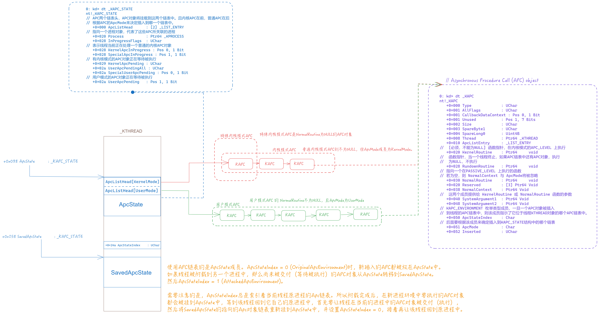

# Asynchronous Procedure Call

**基于WRK(Windows Research Kernel)源代码讲解，它们很可能(或者一定)与当前版本的Windows系统有所不同。不过WRK仍然是现在学习Windows内核的一份重要的参考资料。**

## APC对象

由于Windows中断与异常还没有写出来，所以这边先简单提一下。现在基于x86_64架构的系统下使用APIC(Advanced Programmable Interrupt Controller高级可编程中断控制器，老设备使用PIC最常见的控制器，比如 8259A)来管理操作系统中断，APIC提供了非常强大的中断优先级支持，不过Windows自己还是定义了一套优先级方案，称为中断请求级别(IRQL, Interrupt Request Level)。数值越大，优先级越高。软件中断或非中断的代码的IRQL在内核中管理，而硬件中断则在HAL中被映射到对应的IRQL。
```c
//
// Interrupt Request Level definitions
//

// 最低IRQL，可以被任何高等级的IRQL打断
#define PASSIVE_LEVEL 0             // Passive release level
#define LOW_LEVEL 0                 // Lowest interrupt level
// 在一个线程中插入一个APC可以打断该线程
#define APC_LEVEL 1                 // APC interrupt level
// 代表了调度器正在运行。
#define DISPATCH_LEVEL 2            // Dispatcher level

#define PROFILE_LEVEL 27            // timer used for profiling.
#define CLOCK1_LEVEL 28             // Interval clock 1 level - Not used on x86
#define CLOCK2_LEVEL 28             // Interval clock 2 level
#define IPI_LEVEL 29                // Interprocessor interrupt level
#define POWER_LEVEL 30              // Power failure level
#define HIGH_LEVEL 31               // Highest interrupt level
```

IRQL: APC_LEVEL, 位于 PASSIVE_LEVEL 之上， DISPATCH_LEVEL 之下，专门为异步过程调用的软件中断而保留的IRQL。每个APC都是在特定的线程环境中运行的，从而也一定在特定的进程环境中运行。与DPC不同，DPC是系统全局，且每个处理器都有DPC链表，而APC是针对线程的，每个线程都有自己特有的APC链表。同一个线程的APC也是被排队执行的。当一个线程获得控制时，它的APC过程会被立刻执行。

下面展示了一个APC对象的结构：
```
// Asynchronous Procedure Call (APC) object
0: kd> dt _KAPC
nt!_KAPC
   +0x000 Type             : UChar
   +0x001 AllFlags         : UChar
   +0x001 CallbackDataContext : Pos 0, 1 Bit
   +0x001 Unused           : Pos 1, 7 Bits
   +0x002 Size             : UChar
   +0x003 SpareByte1       : UChar
   +0x004 SpareLong0       : Uint4B
   +0x008 Thread           : Ptr64 _KTHREAD
   +0x010 ApcListEntry     : _LIST_ENTRY
//  [必须，不能为NULL] 函数指针，在内核模式的APC_LEVEL 上执行
   +0x020 KernelRoutine    : Ptr64     void 
//  函数指针，当一个线程终止，如果APC链表中还有APC对象，执行
//  为NULL，不执行
   +0x028 RundownRoutine   : Ptr64     void 
// 指向一个在PASSIVE_LEVEL 上执行的函数
// 若为空，则 NormalContext 与 ApcMode将被忽略
   +0x030 NormalRoutine    : Ptr64     void 
   +0x020 Reserved         : [3] Ptr64 Void
   +0x038 NormalContext    : Ptr64 Void
//  这两个成员提供给 KernelRoutine 或 NormalRoutine 函数的参数
   +0x040 SystemArgument1  : Ptr64 Void
   +0x048 SystemArgument2  : Ptr64 Void
// KAPC_ENVIRONMENT 枚举类型成员，一旦一个APC对象被插入
// 到线程的APC链表中，则该成员指示了它位于线程KTHREAD对象的哪个APC链表中。
   +0x050 ApcStateIndex    : Char
// 后面要根据该成员来确定插入到KAPC_STATE结构中的哪个链表
   +0x051 ApcMode          : Char
   +0x052 Inserted         : UChar
```

两种内核模式APC：特殊APC是NormalRoutine为NULL的APC对象，普通则不为NULL，但ApcMode成员为KernelMode。它们共用一个APC链表，但特殊APC位于链表前，普通在后。**普通APC在被交付时，既执行KernelRoutine也执行NormalRoutine。**

一个线程对象拥有两个关于 `_KAPC_STATE` 结构体的信息，`ApcState` 和 `SavedApcState`。

```
dt _KTHREAD
    ......
   +0x098 ApcState         : _KAPC_STATE
   +0x098 ApcStateFill     : [43] UChar

   +0x24a ApcStateIndex    : UChar

   ......
   +0x258 SavedApcState    : _KAPC_STATE
   +0x258 SavedApcStateFill : [43] UChar
   ......

0: kd> dt _KAPC_STATE
nt!_KAPC_STATE
// APC两个链表头，APC对象将挂载到这两个链表中。且内核APC在前，普通APC在后
// 根据APC的ApcMode来决定插入到哪一个链表中。
   +0x000 ApcListHead      : [2] _LIST_ENTRY
// 指向一个进程对象，代表了这些APC所关联的进程
   +0x020 Process          : Ptr64 _KPROCESS
   +0x028 InProgressFlags  : UChar
// 表示线程当前正在处理一个普通的内核APC对象
   +0x028 KernelApcInProgress : Pos 0, 1 Bit
   +0x028 SpecialApcInProgress : Pos 1, 1 Bit
// 有内核模式的APC对象正在等待被执行
   +0x029 KernelApcPending : UChar
   +0x02a UserApcPendingAll : UChar
   +0x02a SpecialUserApcPending : Pos 0, 1 Bit
// 用户模式的APC对象正在等待被执行
   +0x02a UserApcPending   : Pos 1, 1 Bit
```

```c
// 该代码来自 WRK
typedef enum _KAPC_ENVIRONMENT {
    OriginalApcEnvironment,
    AttachedApcEnvironment,
    CurrentApcEnvironment,
    InsertApcEnvironment
} KAPC_ENVIRONMENT;
```

~~这个地方比较绕~~
使用APC链表的是ApcState成员。ApcStateIndex = 0 (OriginalApcEnvironment)时，也就是当前线程关联的进程是该线程原本附属的进程，那么新插入的APC都被放在ApcState中。如果线程被附载到另一个进程中，那么尚未被交付(等待被执行)的APC对象从ApcState转移到SavedApcState(让SavedApcState.ApcListHead指向ApcState.ApcListHead指向的对象即可)。然后ApcStateIndex = 1 (AttachedApcEnvironment)。需要注意的是，**ApcStateIndex总是索引着当前线程原进程的Apc链表**。所以附载完成后，在新进程环境中要执行的APC对象都会被挂到ApcState中，等到该线程回到它自己的原进程中，首先要让线程在当前的进程中的APC对象被交付（执行），然后将SavedApcState的指向的Apc对象链表重新挂到ApcState中，并设置ApcStateIndex = 0，接着再让该线程回到原进程中。

> Note. 由于ApcStatePointer成员已经在KTHREAD结构中被移除，但其他成员还在，猜测Windows应该是使用了其他方式并根据上面提到的几个成员来进行管理APC（大概叭

**ApcState总是包含了要在当前进程环境中执行的APC对象**

附上一张对上面的过程的总结




## **管理APC**

WRK使用`KeInitializeApc`来初始化一个APC对象。下面展示了该函数的原型，该函数代码非常简单，注释写的比较详细。该函数根据调用者传进来的参数来对APC对象进行初始化。
```c
VOID
KeInitializeApc (
    __out PRKAPC Apc,
    __in PRKTHREAD Thread,
    __in KAPC_ENVIRONMENT Environment,
    __in PKKERNEL_ROUTINE KernelRoutine,
    __in_opt PKRUNDOWN_ROUTINE RundownRoutine,
    __in_opt PKNORMAL_ROUTINE NormalRoutine,
    __in_opt KPROCESSOR_MODE ApcMode,
    __in_opt PVOID NormalContext
    )

```
Apc对象中的ApcStateIndex成员根据Thread参数得到。需要注意的，如果NormalContext为NULL，则该函数会忽略ApcMode参数，直接该ApcMode设为内核模式。

内核要根据`AcpMode` 和`ApcStateIndex`成员来确定要插入的目标线程和APC链表。WRK使用`KiInsertQueueApc`函数来插入一个APC对象。下面展示了`KiInsertQueueApc`函数原型：
```c
VOID
FASTCALL
KiInsertQueueApc (
    IN PKAPC Apc,
    IN KPRIORITY Increment
    )
/*++

Routine Description:

    This function inserts an APC object into a thread's APC queue. The address
    of the thread object, the APC queue, and the type of APC are all derived
    from the APC object. If the APC object is already in an APC queue, then
    no operation is performed and a function value of FALSE is returned. Else
    the APC is inserted in the specified APC queue, its inserted state is set
    to TRUE, and a function value of TRUE is returned. The APC will actually
    be delivered when proper enabling conditions exist.

    N.B. The thread APC queue lock must be held when this routine is called.

    N.B. It is the responsibility of the caller to ensure that the APC is not
         already inserted in an APC queue and to set the Inserted field of
         the APC.

Arguments:

    Apc - Supplies a pointer to a control object of type APC.

    Increment - Supplies the priority increment that is to be applied if
        queuing the APC causes a thread wait to be satisfied.

Return Value:

    None.

--*/
```

```c
    Thread = Apc->Thread;
    // 
    if (Apc->ApcStateIndex == InsertApcEnvironment) {
        Apc->ApcStateIndex = Thread->ApcStateIndex;
    }

    ApcState = Thread->ApcStatePointer[Apc->ApcStateIndex];
    //
    // Insert the APC after all other special APC entries selected by
    // the processor mode if the normal routine value is NULL. Else
    // insert the APC object at the tail of the APC queue selected by
    // the processor mode unless the APC mode is user and the address
    // of the special APC routine is exit thread, in which case insert
    // the APC at the front of the list and set user APC pending.
    //


    ApcMode = Apc->ApcMode;

    ASSERT (Apc->Inserted == TRUE);

    // 如果NormalRoutine不为NULL，并且ApcMode不为KernelMode，则判断该APC为用户
    // APC，插入ApcListHead[ApcMode]链表头的后面，如果为KernelMode，则插入到链表的末尾。
    if (Apc->NormalRoutine != NULL) {
        if ((ApcMode != KernelMode) && (Apc->KernelRoutine == PsExitSpecialApc)) {
            Thread->ApcState.UserApcPending = TRUE;
            InsertHeadList(&ApcState->ApcListHead[ApcMode],
                           &Apc->ApcListEntry);

        } else {
            InsertTailList(&ApcState->ApcListHead[ApcMode],
                           &Apc->ApcListEntry);
        }

    } else {
        ListEntry = ApcState->ApcListHead[ApcMode].Blink;
        while (ListEntry != &ApcState->ApcListHead[ApcMode]) {
// #define CONTAINING_RECORD(address,type,field) ((type *)((PCHAR)(address) - (ULONG_PTR)(&((type *)0)->field)))
            ApcEntry = CONTAINING_RECORD(ListEntry, KAPC, ApcListEntry);
            if (ApcEntry->NormalRoutine == NULL) {
                break;
            }

            ListEntry = ListEntry->Blink;
        }

        InsertHeadList(ListEntry, &Apc->ApcListEntry);
    }
```
然后内核会依据不同的情形，插入到APC链表。用户模式的APC插入到用户模式APC链表`ApcListHead[UserMode]`中；普通内核模式的APC插入到链表尾; 而对于特殊内核模式APC，KiInsertQueueApc从链表尾部开始查找，找到第一个NormalRoutine为NULL的APC对象，然后将新插入的APC对象接在它的后面。特殊APC总是在普通APC对象的前面。

所以，一个线程的两个APC链表，被划分为UserMode KernelMode 两组。其中内核模式APC链表中，特殊内核模式APC在链表的最前面。
如果插入的APC的ApcMode为KernelMode，则 设置 Thread->ApcState.KernelApcPending 为 TRUE，表示存在内核APC等待被交付。
```c
// apcsup.c 500 ~ 517
        if (Thread == KeGetCurrentThread()) {

            ASSERT(Thread->State == Running);

            //
            // If the APC mode is kernel, then set kernel APC pending and
            // request an APC interrupt if special APC's are not disabled.
            //

            if (ApcMode == KernelMode) {
                Thread->ApcState.KernelApcPending = TRUE;
                if (Thread->SpecialApcDisable == 0) {
                    KiRequestSoftwareInterrupt(APC_LEVEL);
                }
            }

            return;
        }

```
如果线程正在被执行，则请求一个中断。如果线程是等待的，并且没有禁用内核模式Apc，则调用KiUnwaitThread，该函数会调用KiReadyThread唤醒该线程,执行APC交付。下面这段代码描述了这个过程：
```c
// apcsup.c 553 ~ 563
if (ThreadState == Running) {
    RequestInterrupt = TRUE;

} else if ((ThreadState == Waiting) &&
            (Thread->WaitIrql == 0) &&
            (Thread->SpecialApcDisable == 0) &&
            ((Apc->NormalRoutine == NULL) ||
            ((Thread->KernelApcDisable == 0) &&
                (Thread->ApcState.KernelApcInProgress == FALSE)))) {

    KiUnwaitThread(Thread, STATUS_KERNEL_APC, Increment);
} 
```
如果为UserMode，则将Thread->ApcState.UserApcPending设置为TRUE，然后直接调用KiUnwaitThread。

函数最后最后请求一个APC中断。
```c
KiRequestApcInterrupt(Thread->NextProcessor);
```

## APC 交付情况

APC 对象被插入到线程的APC链表中以后，一旦APC_LEVEL 软件中断发生，或者IRQL从高降低到APC_LEVEL以下，则当前线程的APC被交付。WRK使用`KiDeliverApc`函数进行APC交付，下面展示了改函数的原型。
```c
// apcsup.c 77 ~ 378
KiDeliverApc (
    IN KPROCESSOR_MODE PreviousMode,
    IN PKEXCEPTION_FRAME ExceptionFrame,
    IN PKTRAP_FRAME TrapFrame
    )
```
```
描述 apcsup.c 文件中 154 - 377 的代码内容

如果特殊APC被启用：

    遍历内核模式APC链表

        提升IRQL到DISPATCHER_LEVEL 等级，锁上APC队列
        
        如果内核模式APC队列的APC对象为空
            释放锁，中断循环，去交付user APC
        
        如果NormalRoutine == NULL
            从队列中移除该对象，释放锁，调用KernelRoutine
            等待函数返回，继续执行循环
        否则
            如果该线程并没有在处理一个普通内核APC对象，即线程的ApcState.KernelApcInProgress为False
                从队列中移除该对象，释放锁，调用KernelRoutine
                Thread->ApcState.KernelApcInProgress = TRUE
                降低IRQL为PASSIVE_LEVEL，调用NormalRoutine
                提升IRQL为APC_LEVEL
                Thread->ApcState.KernelApcInProgress = FALSE

    如果PreviousMode == UserMode

        提升IRQL到DISPATCHER_LEVEL 等级，锁上APC队列
        
        如果用户APC队列的APC对象为空
            释放锁, goto CheckProcess
        
        释放锁，交付KernelRoutine

            如果NormalRoutine为空
                调用KeTestAlertThread(UserMode)
            否则
                调用KiInitializeUserApc设置好用户APC例程
                将陷阱帧中的用户模式返回地址设置为KeUserApcDisPatcher
                （找不到该函数，我在Windows10中的ntdll.dll也没找到类似的函数名，可能改名了吧）
                传递NormalRoutine等信息。
设置陷阱帧      
```

用户模式APC的NormalRoutine是一个在用户模式下运行的函数，位于用户地址空间。而KiDeliverApc是在内核模式下运行的，所以KiDeliverApc只是调用KiInitializeUserApc来设置好用户的APC例程将来被调用的环境。从内核模式到用户模式是通过一个陷阱帧来返回的，KiInitializeUserApc将陷阱帧中的用户模式返回地址EIP寄存器设置为KeUserApcDispatcher函数的地址。

**APC触发**

当遇到以下4中情况之一时，APC会被交付:

1. 当内核代码离开一个临界区或者守护区(调用`KeLeaveGuardedRegion` 或`KeLeaveCriticalRegion` )时，通过`KiCheckForKernelApcDelivery`函数直接调用`KiDeliverApc`，或者调用`KiRequestSoftwareInterrupt`函数请求一个 APC_LEVEL 的软件中断。这是因为，当线程进入临界区或守护区时，普通内核模式APC或特殊内核模式APC被禁止了，所以，当离开时，`KiCheckForKernelApcDelivery` 函数被调用,以便及时地交付内核模式APC。

2. 当一个线程经过一次环境切换而获得控制时，如果有内核模式APC需要被交付,则在`KiSwapThread`函数返回以前，调用`KiDeliverApc`函数交付该内核模式APC。

3. **当系统服务或异常处理函数返回到用户模式时**, `KiDeliverApc`函数被调用以便交付用户模式APC。

4. 在APC_LEVEL软件中断发生时，HAL模块中的软件中断处理函数( `HalpDispatchSoftwareInterrupt` )调用KiDeliverApc来交付内核模式APC。当内核代码调用KeLowerIrql函数降低IRQL到PASSIVE_LEVEL时，KiDeliverApc 函数也会被调用。

情况四会造成一种很有趣的现象，由于在处理普通内核模式APC时会将IRQL降低为PASSIVE_LEVEL时，这时候KiDeliverApc又会被调用，所以在内核处理普通内核APC的NormalRoutine时的顺序是后进先出。
