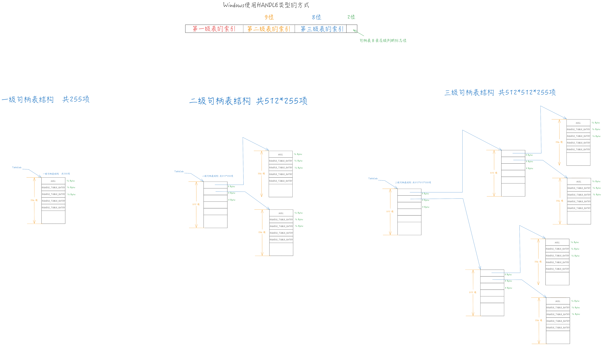

# 深入解析Windows句柄

**感谢`Stack Overflow`用户`Neitsa`为我详细解答了<如果通过Windows的句柄来找到对应的对象类型?>**
原贴：https://stackoverflow.com/questions/77814442/how-windows-handle-to-associate-corresponding-object-type

Windows执行体实现了一套对象机制来管理各种资源和实体。每种对象都有一个与之对应的对象类型，对象类型定义了该类对象的一些特性和方法。对象类型通过提供的自定义的Parse方法可以扩展此名字空间。对象管理器中的对象是执行体对象，它们位于系统空间中；在进程空间不能通过地址来引用他们，Windows使用句柄(handle)来管理进程中的对象引用。

当进程创建或打开一个对象时，将获得一个句柄，该句柄指向所创建或打开的对象。例如，`CreateProcess`API将创建两个对象，一个是子进程的句柄，一个是子进程中主线程的句柄，后续对该进程或者线程的操作就可以使用这两个句柄进行，这样做可以显著地提高引用对象的效率。

在Windows中，句柄是一个进程范围内的对象引用，Windows的句柄是一个索引，指向该句柄所在的进程的句柄表(struct _HANDLE_TABLE)的一个表项(struct _HANDLE_TABLE_ENTRY)。

Windows内核使用`struct _EPROCESS`结构体来描述一个进程，该结构体的一个成员`ObjectTable`指向了该进程的句柄表。一个进程的句柄表包含了所有已被该进程打开的那些对象的指针。

我们先来了解Windows句柄表的结构，然后再来分析Windows是如何使用这些信息找到对应的对象。下面展示了Windows句柄表的结构：

```
0: kd> dt nt!_handle_table
下一次句柄表扩展的起始句柄索引
   +0x000 NextHandleNeedingPool : Uint4B
   +0x004 ExtraInfoPages   : Int4B
指向句柄表的存储结构
   +0x008 TableCode        : Uint8B
句柄表的内存资源记录在此进程中
   +0x010 QuotaProcess     : Ptr64 _EPROCESS
所有句柄表形成一个链表，链表头为全局变量 HandleTableListHead
   +0x018 HandleTableList  : _LIST_ENTRY
创建进程的ID
   +0x028 UniqueProcessId  : Uint4B
   +0x02c Flags            : Uint4B
是否使用FIFO风格重用，先释放先用
   +0x02c StrictFIFO       : Pos 0, 1 Bit
   +0x02c EnableHandleExceptions : Pos 1, 1 Bit
   +0x02c Rundown          : Pos 2, 1 Bit
   +0x02c Duplicated       : Pos 3, 1 Bit
   +0x02c RaiseUMExceptionOnInvalidHandleClose : Pos 4, 1 Bit
   +0x030 HandleContentionEvent : _EX_PUSH_LOCK
句柄表锁，仅在句柄表扩展时使用
   +0x038 HandleTableLock  : _EX_PUSH_LOCK
空闲链表表头的句柄索引
   +0x040 FreeLists        : [1] _HANDLE_TABLE_FREE_LIST
   +0x040 ActualEntry      : [32] UChar
   +0x060 DebugInfo        : Ptr64 _HANDLE_TRACE_DEBUG_INFO
```

`TableCode`是一个指针，指向了句柄表的最高表项层面，它的最低两位的值代表了当前句柄表的层数。如果`TableCode`的最低2位为0，说明句柄表只有一层，此种情况下该进程最多只能容纳 `256 - 1` (句柄表的第一项需要被设置为0) 个句柄。

本节使用`LearnHandle.exe`程序作为示例，该程序的源代码如下：
```c
// LearnHandle.cpp
// 该程序使用`CreateProcess`函数打开了`pop.exe`程序，接着使用弹窗来显示新打开的进程的句柄，和它的主线程的句柄。
#include <windows.h>
#include <stdlib.h>
#include <stdio.h>
int main() {

    STARTUPINFOW startup = { 0 };
    startup.cb = sizeof startup;
    PROCESS_INFORMATION pi = { 0 };
    BOOL createProcResult = FALSE;
    if (!CreateProcessW(L"C:\\pop.exe", NULL, NULL, NULL, TRUE, 0, NULL, NULL, &startup, &pi))
        MessageBoxA(NULL, "Create Process Failed", "Alert", MB_OK);

    char handle[80] = { 0 };
    sprintf_s(handle, "Process Handle: %llu ProcessId: %llu", pi.hProcess, pi.dwProcessId);
    MessageBoxA(NULL, handle, "Process", MB_OK);
    sprintf_s(handle, "Thread Handle: %llu ThreadId: %llu", pi.hThread, pi.dwThreadId);
    MessageBoxA(NULL, handle, "Thread", MB_OK);
    system("pause");
    CloseHandle(pi.hThread);
    CloseHandle(pi.hProcess);
}
```
```
0: kd> !process 0 0 LearnHandle.exe
PROCESS ffff808da1ee00c0
    SessionId: 1  Cid: 1c10    Peb: 002f4000  ParentCid: 1600
    DirBase: 54759000  ObjectTable: ffff91804f5e29c0  HandleCount: 147.
    Image: LearnHandle.exe
```
```
0: kd> dt nt!_eprocess ffff808da1ee00c0 -y ObjectTable
   +0x570 ObjectTable : 0xffff9180`4f5e29c0 _HANDLE_TABLE
```

可以看到该进程的PROCESS结构体地址为ffff808da1ee00c0，而对象表地址为0xffff9180`4f5e29c0，总共有 147 个句柄。

```
0: kd> dt nt!_handle_table 0xffff9180`4f5e29c0
   +0x000 NextHandleNeedingPool : 0x400
   +0x004 ExtraInfoPages   : 0n0
   +0x008 TableCode        : 0xffff9180`493d0000
   +0x010 QuotaProcess     : 0xffff808d`a1ee00c0 _EPROCESS
   +0x018 HandleTableList  : _LIST_ENTRY [ 0xffff9180`4f5e4918 - 0xffff9180`4e6dc258 ]
   +0x028 UniqueProcessId  : 0x1c10
   +0x02c Flags            : 0
   +0x02c StrictFIFO       : 0y0
   +0x02c EnableHandleExceptions : 0y0
   +0x02c Rundown          : 0y0
   +0x02c Duplicated       : 0y0
   +0x02c RaiseUMExceptionOnInvalidHandleClose : 0y0
   +0x030 HandleContentionEvent : _EX_PUSH_LOCK
   +0x038 HandleTableLock  : _EX_PUSH_LOCK
   +0x040 FreeLists        : [1] _HANDLE_TABLE_FREE_LIST
   +0x040 ActualEntry      : [32]  ""
   +0x060 DebugInfo        : (null) 
```

通过上面的结果可以得到该进程对象表的 NextHandleNeedingPool 值为 0x400，该程序中使用的句柄的值不能超过该值。TableCode的值为 0xffff9180`493d0000。对于此进程的句柄表，它只有一级句柄表结构，该表的每一项成员为16个字节。第一个成员为NULL。

```
0: kd> dp 0xffff9180`493d0000
ffff9180`493d0000  00000000`00000000 00000000`00000000
ffff9180`493d0010  808da229`0d30fffd 00000000`001f0003
ffff9180`493d0020  808da229`0f30fffd 00000000`001f0003
ffff9180`493d0030  808da229`1130ffbb 00000000`001f0003
ffff9180`493d0040  808d9f53`3640ffbd 00000000`00000001
ffff9180`493d0050  808da234`7c90ffab 00000000`001f0003
ffff9180`493d0060  808d9f13`5900ff9f 00000000`000f00ff
ffff9180`493d0070  808da1ce`8d60fffd 00000000`00100002
```

句柄表的每一项具有16个字节，它的结构如下：
```
0: kd> dt nt!_handle_table_entry
   +0x000 VolatileLowValue : Int8B
   +0x000 LowValue         : Int8B
   +0x000 InfoTable        : Ptr64 _HANDLE_TABLE_ENTRY_INFO
   +0x008 HighValue        : Int8B
   +0x008 NextFreeHandleEntry : Ptr64 _HANDLE_TABLE_ENTRY
   +0x008 LeafHandleValue  : _EXHANDLE
   +0x000 RefCountField    : Int8B
   +0x000 Unlocked         : Pos 0, 1 Bit
   +0x000 RefCnt           : Pos 1, 16 Bits
   +0x000 Attributes       : Pos 17, 3 Bits
   +0x000 ObjectPointerBits : Pos 20, 44 Bits
   +0x008 GrantedAccessBits : Pos 0, 25 Bits
   +0x008 NoRightsUpgrade  : Pos 25, 1 Bit
   +0x008 Spare1           : Pos 26, 6 Bits
   +0x00c Spare2           : Uint4B
```

下面是Windows根据句柄值来找到对应的句柄表项的函数的反汇编结果(已添加注释):
```
PAGE:0000000140645680
PAGE:0000000140645680                               ; =============== S U B R O U T I N E =======================================
PAGE:0000000140645680
PAGE:0000000140645680
PAGE:0000000140645680                               ExpLookupHandleTableEntry proc near     ; CODE XREF: ObReferenceFileObjectForWrite+87↑p
PAGE:0000000140645680                                                                       ; AlpcpLookupMessage+75↑p
PAGE:0000000140645680                                                                       ; NtClose+B5↑p
PAGE:0000000140645680                                                                       ; ObpReferenceObjectByHandleWithTag+EA↑p
PAGE:0000000140645680                                                                       ; ExMapHandleToPointer+15↓p
PAGE:0000000140645680                                                                       ; ExDupHandleTable+5B↓p
PAGE:0000000140645680                                                                       ; ExDupHandleTable+16B↓p
PAGE:0000000140645680                                                                       ; ExDupHandleTable+17E↓p
PAGE:0000000140645680                                                                       ; ObWaitForMultipleObjects+11D↓p
PAGE:0000000140645680                                                                       ; ObpReferenceProcessObjectByHandle+7C↓p
PAGE:0000000140645680                                                                       ; PspReferenceCidTableEntry+36↓p
PAGE:0000000140645680                                                                       ; ExEnumHandleTable+10A↓p
PAGE:0000000140645680                                                                       ; ExpGetNextHandleTableEntry+1D↓p
PAGE:0000000140645680                                                                       ; ExSweepHandleTable+6C↓p
PAGE:0000000140645680                                                                       ; ExpGetHandleExtraInfo+21↓p ...
PAGE:0000000140645680 8B 01                         mov     eax, [rcx]                      ; rcx是nt!_eprocess::ObjectTable的成员值，rdx是需要查询的句柄的值。
PAGE:0000000140645682 48 83 E2 FC                   and     rdx, 0FFFFFFFFFFFFFFFCh         ; 将索引信息的后两位设置为0
PAGE:0000000140645686 48 3B D0                      cmp     rdx, rax                        ; 将传入的索引值与句柄表的NextHandleNeedingPool进行比较
PAGE:0000000140645686                                                                       ; 如果索引值大于等于该值就跳转到 loc_1406456E5 位置，结束函数
PAGE:0000000140645689 73 5A                         jnb     short loc_1406456E5
PAGE:0000000140645689
PAGE:000000014064568B 4C 8B 41 08                   mov     r8, [rcx+8]                     ; 将TableCode复制到r8寄存器，再复制后4个字节到eax寄存器
PAGE:000000014064568B                                                                       ; 获取该句柄表指针的最后两位
PAGE:000000014064568B                                                                       ; 如果最后两位的值不等于十进制的1，就跳转到 loc_1406456B2位置
PAGE:000000014064568F 41 8B C0                      mov     eax, r8d
PAGE:0000000140645692 83 E0 03                      and     eax, 3
PAGE:0000000140645695 83 F8 01                      cmp     eax, 1
PAGE:0000000140645698 75 18                         jnz     short loc_1406456B2
PAGE:0000000140645698
PAGE:000000014064569A 48 8B C2                      mov     rax, rdx                        ; 此时，该句柄表具有二级结构
PAGE:000000014064569D 48 C1 E8 0A                   shr     rax, 0Ah
PAGE:00000001406456A1 81 E2 FF 03 00 00             and     edx, 3FFh
PAGE:00000001406456A7 49 8B 44 C0 FF                mov     rax, [r8+rax*8-1]
PAGE:00000001406456AC 48 8D 04 90                   lea     rax, [rax+rdx*4]
PAGE:00000001406456B0 C3                            retn
PAGE:00000001406456B0
PAGE:00000001406456B0                               ; ---------------------------------------------------------------------------
PAGE:00000001406456B1 CC                            align 2
PAGE:00000001406456B2
PAGE:00000001406456B2                               loc_1406456B2:                          ; CODE XREF: ExpLookupHandleTableEntry+18↑j
PAGE:00000001406456B2 85 C0                         test    eax, eax                        ; 判断该句柄表具有1级结构还是3级结构，如果是后者就跳转
PAGE:00000001406456B4 75 06                         jnz     short loc_1406456BC
PAGE:00000001406456B4
PAGE:00000001406456B6 49 8D 04 90                   lea     rax, [r8+rdx*4]                 ; 该句柄表只有1级结构
PAGE:00000001406456BA C3                            retn
PAGE:00000001406456BA
PAGE:00000001406456BA                               ; ---------------------------------------------------------------------------
PAGE:00000001406456BB CC                            align 4
PAGE:00000001406456BC
PAGE:00000001406456BC                               loc_1406456BC:                          ; CODE XREF: ExpLookupHandleTableEntry+34↑j
PAGE:00000001406456BC 48 8B CA                      mov     rcx, rdx                        ; 此句柄表具有3级结构
PAGE:00000001406456BF 48 C1 E9 0A                   shr     rcx, 0Ah
PAGE:00000001406456C3 48 8B C1                      mov     rax, rcx
PAGE:00000001406456C6 81 E1 FF 01 00 00             and     ecx, 1FFh
PAGE:00000001406456CC 48 C1 E8 09                   shr     rax, 9
PAGE:00000001406456D0 81 E2 FF 03 00 00             and     edx, 3FFh
PAGE:00000001406456D6 49 8B 44 C0 FE                mov     rax, [r8+rax*8-2]
PAGE:00000001406456DB 48 8B 04 C8                   mov     rax, [rax+rcx*8]
PAGE:00000001406456DF 48 8D 04 90                   lea     rax, [rax+rdx*4]
PAGE:00000001406456E3 C3                            retn
PAGE:00000001406456E3
PAGE:00000001406456E3                               ; ---------------------------------------------------------------------------
PAGE:00000001406456E4 CC                            db 0CCh
PAGE:00000001406456E5                               ; ---------------------------------------------------------------------------
PAGE:00000001406456E5
PAGE:00000001406456E5                               loc_1406456E5:                          ; CODE XREF: ExpLookupHandleTableEntry+9↑j
PAGE:00000001406456E5 33 C0                         xor     eax, eax
PAGE:00000001406456E7 C3                            retn
PAGE:00000001406456E7
PAGE:00000001406456E7                               ExpLookupHandleTableEntry endp
PAGE:00000001406456E7
PAGE:00000001406456E7                               ; ---------------------------------------------------------------------------
```

下面这张图展示了Windows的句柄表结构(使用了"页表"这种数据结构，本篇不详细介绍页表机制):



需要特别注意的是下面这段代码：
```nasm
; rcx为 ObjectTable 的值，将 NextHandleNeedingPool 的值复制到 eax
; 由于该进程的句柄表为一级句柄表，所以该值为 0x400，不同级别的句柄表拥有不同的值
mov     eax, [rcx]  
; rdx 为传入的句柄的值，将句柄值的后两位清0，也就是确保句柄值是4的倍数
and     rdx, 0FFFFFFFFFFFFFFFCh
; 将句柄值与 NextHandleNeedingPool 比较，如果超过该值，就出错。
cmp     rdx, rax
jnb     short loc_1406456E5 
```

接下来讲解一下为什么是0x400，由于示例系统是 x64 位的 Windows11系统。句柄表是按照页来扩展的，一张句柄表的内存大小为一页(4096 / 0x1000h 字节)。句柄项的大小为 16 0x10h 字节。
所以可以得到一级句柄表总共有 256 项:
$$
4096 \div 16 = 256
$$
由于第一项被操作系统保留，所以最多只能有 255 项。
下面这条汇编展示了Windows计算句柄表偏移的方法：
```nasm
lea     rax, [r8+rdx*4]                 ; 该句柄表只有1级结构
```

$TableCode + HandleValue * 4$ 由于句柄值为 4 的倍数，将其乘以4即，句柄值一定为16的倍数。上面提到过，句柄表的每一项为16个字节，所以根据这种计算方式，即可找到对应的对象。二级句柄表和三级句柄表也是同样的机制。


可以看到 LearnHandle.exe 进程对 pop.exe 进程的引用的句柄值为 260 (0x104h)

```
0: kd> ? 0xffff9180`493d0000 + (104 * 4)
Evaluate expression: -121494806133744 = ffff9180`493d0410
```

该句柄项的内容如下：
```
0: kd> dt _handle_table_entry ffff9180`493d0410
nt!_HANDLE_TABLE_ENTRY
   +0x000 VolatileLowValue : 0n-9183506663656587273
   +0x000 LowValue         : 0n-9183506663656587273
   +0x000 InfoTable        : 0x808da158`8050fff7 _HANDLE_TABLE_ENTRY_INFO
   +0x008 HighValue        : 0n2097151
   +0x008 NextFreeHandleEntry : 0x00000000`001fffff _HANDLE_TABLE_ENTRY
   +0x008 LeafHandleValue  : _EXHANDLE
   +0x000 RefCountField    : 0n-9183506663656587273
   +0x000 Unlocked         : 0y1
   +0x000 RefCnt           : 0y0111111111111011 (0x7ffb)
   +0x000 Attributes       : 0y000
   +0x000 ObjectPointerBits : 0y10000000100011011010000101011000100000000101 (0x808da158805)
   +0x008 GrantedAccessBits : 0y0000111111111111111111111 (0x1fffff)
   +0x008 NoRightsUpgrade  : 0y0
   +0x008 Spare1           : 0y000000 (0)
   +0x00c Spare2           : 0
```
有两个需要关注的成员：
- `GrantedAccessBits`: 它是对象的Granted Access Mask，记录了对该对象拥有的权限。
- `ObjectPointerBits`: 经过计算后将得到一个指向一个对象的`_OBJECT_HEADER`结构体的指针。

通过计算即可得到对象头的地址: `(ObjectPointerBits) << 4 | 0xffff000000000000`。
至于为什么是 `0xffff000000000000`，可以参考这篇文章 [Windows x64 Kernel Virtual Address Space Layout](https://codemachine.com/articles/x64_kernel_virtual_address_space_layout.html)。

```
0: kd> ? (0x808da158805 << 4) | 0xffff000000000000
Evaluate expression: -140129191034800 = ffff808d`a1588050
```
接着我们就得到了对象头的地址 0xffff808d`a1588050
```
0: kd> dt nt!_object_header ffff808d`a1588050
   +0x000 PointerCount     : 0n326915
   +0x008 HandleCount      : 0n9
   +0x008 NextToFree       : 0x00000000`00000009 Void
   +0x010 Lock             : _EX_PUSH_LOCK
   +0x018 TypeIndex        : 0xaf ''
   +0x019 TraceFlags       : 0 ''
   +0x019 DbgRefTrace      : 0y0
   +0x019 DbgTracePermanent : 0y0
   +0x01a InfoMask         : 0x88 ''
   +0x01b Flags            : 0 ''
   +0x01b NewObject        : 0y0
   +0x01b KernelObject     : 0y0
   +0x01b KernelOnlyAccess : 0y0
   +0x01b ExclusiveObject  : 0y0
   +0x01b PermanentObject  : 0y0
   +0x01b DefaultSecurityQuota : 0y0
   +0x01b SingleHandleEntry : 0y0
   +0x01b DeletedInline    : 0y0
   +0x01c Reserved         : 0
   +0x020 ObjectCreateInfo : 0xffff808d`9e43ccc0 _OBJECT_CREATE_INFORMATION
   +0x020 QuotaBlockCharged : 0xffff808d`9e43ccc0 Void
   +0x028 SecurityDescriptor : 0xffff9180`4ce8c06f Void
   +0x030 Body             : _QUAD
```


其中`Process Explorer`展示的`pop.exe`对象的地址为：

在得到对象头后，需要通过下面的计算得到对应的对象类型：`0xffff808da1588080`，也就是我们找到的对象头的Body的地址(0xffff808d`a1588050 + 0x30)。

```
*((BYTE*)nt!ObHeaderCookie) ^ second_byte_of_object_header_address ^ _OBJECT_HEADER.TypeIndex
```
```
0: kd> db nt!ObHeaderCookie L1
fffff801`5f31ed74  28   

0: kd> ? (ffff808d`a1588050 >> 8) & 0xff
Evaluate expression: 128 = 00000000`00000080

0: kd> dt nt!_object_header ffff808d`a1588050 -y TypeIndex
   +0x018 TypeIndex : 0xaf ''

0: kd> ? 0x28 ^ 0x80 ^ 0xaf
Evaluate expression: 7 = 00000000`00000007
```
在这个示例中，我们得到的结果是 0x7。系统有一个全局变量ObpObjectTypes 数组记录了所有已创建的类型，这是一个`_OBJECT_TYPE`数组。
```
0: kd>  dt _OBJECT_TYPE poi(nt!ObTypeIndexTable + (0x7 * 8))
nt!_OBJECT_TYPE
   +0x000 TypeList         : _LIST_ENTRY [ 0xffff808d`99aead20 - 0xffff808d`99aead20 ]
   +0x010 Name             : _UNICODE_STRING "Process"
   +0x020 DefaultObject    : (null) 
   +0x028 Index            : 0x7 ''
   +0x02c TotalNumberOfObjects : 0xa2
   +0x030 TotalNumberOfHandles : 0x6a4
   +0x034 HighWaterNumberOfObjects : 0xa2
   +0x038 HighWaterNumberOfHandles : 0x6ae
   +0x040 TypeInfo         : _OBJECT_TYPE_INITIALIZER
   +0x0b8 TypeLock         : _EX_PUSH_LOCK
   +0x0c0 Key              : 0x636f7250
   +0x0c8 CallbackList     : _LIST_ENTRY [ 0xffff9180`46d07c40 - 0xffff9180`46d07c40 ]
```
所以，该句柄关联的是一个 `Process` 对象。