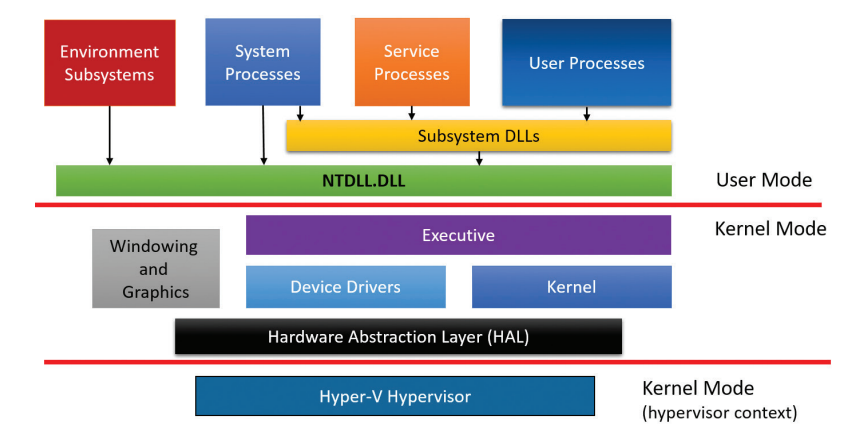
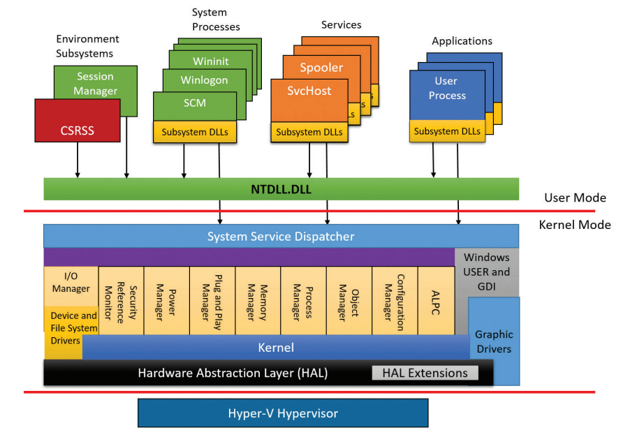

# Windows Overview

## Windows内核结构
操作系统本身属于软件的范畴，但是它需要紧密地跟硬件打交道，它为上层应用软件或应用系统提供了一层抽象，专门负责硬件资源的管理和分配。应用软件不需要直接跟硬件打交道，它们利用操作系统提供的功能来实现各种应用任务，如果它们要访问硬件，则必须通过操作系统提供的抽象接口来完成。

现代操作系统拥有两种特权级模式：内核模式(Privilege 0, 数字越低级别越高，运行在Ring 0环境下)和用户模式(Privilege 3, 运行在Ring 3环境下)。虽然x86_64架构提供了4种特权等级，初衷是为了让部分驱动程序或者应用程序运行在 Ring 1 和 Ring 2环境下，这样的好处是即使驱动程序崩溃，内核并不受牵连仍然可以正常的运行。但这种设计大大增加了操作系统的复杂度，Windows和Linux都只有两种特权级。操作系统核心运行在内核模式下，用户程序运行在用户模式。

下图展示了Windows内核结构的简化版本

第一条红色的横线划分Windows的用户模式和内核模式两部分，上面代表用户层，用户进程在上面执行，下面是内核层，内核管理着计算机资源，并为用户层程序提供API供上层程序使用。

第二条红色的横线划分内核和虚拟机。严格来讲，虚拟机仍然运行在与内核相同的特权级，但是不同在于它使用了专用的CPU指令集(Intel的 VT-x, AMD的SVM)。它们将自身与内核隔离，与此同时，它也监视着内核和应用程序。关于该层还有一个不准确的叫法"ring -1"。

用户模式下的进程可以被描述为下面4种基本类型：

- 用户进程(User processes)  该类型又可以分为两类，Classic Apps，如使用CreateProcess API创建的进程。另一种是现代应用程序(Modern Apps，或称 UWP apps 或者 immersive Proceses)。

- 服务进程(Service processes)  这些进程承载Windows服务。比如Tash Scheduler。Windows管理工具组件提供了 服务 程序，该程序可以查看当前系统中所有的服务进程。

- 系统进程(System processes)  它们是固有的进程，例如登录进程或者会话管理器。它们并不是Windows服务。即，它们并不通过服务控制管理器启动。

- 环境子系统服务进程(Environment subsystem server processes)   它们为用户和程序员们提供了对其他操作系统环境或特性的部分支持。Windows NT原本支持三种子系统环境：Win32，POSIX和OS/2。现代Windows已经不提供除了Win32子系统之外的其他两个子系统环境。Windows 7 系统提供了一个叫做SUA(Subsystem for UNIX-based Applications)的增强版本的POSIX子系统。Windows 10 Version 1607之后的版本包含了一个WSL(Windows Subsystem for Linux)，但它并能不算是本节描述的子系统。

内核组件包含以下部分：

- 硬件抽象层(Hardware Abstraction Layer)    该层直接与硬件打交道。这一层的用意是把所有与硬件相关联的代码逻辑隔离到一个专门的模块中，从而使上面的层次尽可能做到独立于硬件平台。

- 内核(Kernel)  由低级的操作系统功能组成，比如线程调度，中断，异常分发和多处理器同步。它也提供了一组例程和基本对象供执行体层使用它们来完成更高层的构造。内核层既与硬件抽象层打交道，又与执行体层打交道。它将HAL提供的功能进行"封装"，供执行体层使用。

- 设备驱动(Device drivers)  它既包含硬件设备驱动，也包含非硬件设备驱动。前者用来传输用户的I/O函数调用到特定的硬件设备。后者是一些文件系统驱动或网络驱动等一些不需要非硬件的操作系统重要组件。

- 执行体(Executive) Windows的执行体包含基本的操作系统服务，比如内存管理，进程线程管理等。执行体利用内核提供的基本例程去构造更高级的例程，一些例程作为系统的API。上层的用户调用NTDLL.DLL提供的API，而NTDLL.DLL的函数才真正地调用系统API。

- 窗口和图形系统(The windowing and graphics system)  它实现了图形用户界面（GUI）功能（更广为人知的是Windows user和GDI功能），例如处理窗口、用户界面控件和绘图。 

- 虚拟机层(The hypervisor layer) 它仅由一个组件组成：虚拟机本身。此环境中没有驱动程序或其他模块。也就是说，虚拟机本身就是由多个内部层和服务组成，如其自己的内存管理器、虚拟处理器调度器、中断和定时器管理、同步例程等。

## 系统组件

**Environment Subsystems And Subsystem DLLs**

Windows环境子系统(Environment Subsystems)的作用是为应用程序提供一些Windows执行体层的系统服务。Windows的每种子系统都可以提供一些不同的服务，即，在一个子系统上构建的应用程序不能在另一个子系统上运行，因为他们使用的服务不同，或者说，他们使用的子系统的DLL不同。

每一种可执行文件只对应一种子系统。当文件被加载时，进程创建代码会检查该文件的头部。该头部的其中一项信息标识了该文件对应的子系统。Microsoft Visual Studio的链接器选项有一项为`/SUBSYSTEM`。

由于用户程序不能直接调用Windows系统服务，作为代替，他们调用一个或多个子系统的DLL。这些DLL被封装系统服务，暴露给用户。比如：Windows子系统DLL(例如: KERNEL32.dll, USER32.dll等)实现Windows API 函数，当应用程序需要使用Windows系统服务时，它可以链接这些DLL，进行API调用。

**Windows(Win32) Subsystem**

Windows被设计为支持多种环境子系统，但是为每种子系统提供所有同种功能的代码是一件及其复杂且庞大的工程，更重要的是，这会影响系统体积和性能。最终，Windows(或Win32)成为了主要的子系统。按照 Windows NT 最初的设计，它支持三个环境子系统:OS/2、POSIX 和 Windows。然而，Windows 子系统是必须要运行的，没有它 Windows 系统无法运行，因为SUA子系统调用系统服务是需要在Windows(Win32)子系统里面执行I/O。而其他两个子系统则被配置成按需启动。到了Windows XP以后,只有Windows子系统随 Windows系统一起发行。

Windows子系统由以下主要的组件组成：
- 对于每个回话(Session)，一个环境子系统进程的实例需要加载4个Dll(Basesrv.dll, Winsrv.dll, Sxssrv.dll和Csrsrv.dll)，它们包含下列支持：
  - 与创建和删除进程和线程相关的各种内务管理任务
  - 关闭Windows应用程序（通过ExitWindowsEx API）
  - 包含.ini文件到注册表的位置映射，以实现向后兼容
  - 发送某些内核通知消息（例如来自即插即用的消息管理器）作为窗口消息（WM_DEVICECHANGE）发送到Windows应用程序
  - 部分支持16位虚拟DOS机（VDM）进程（仅限32位Windows）
  - 并排（SxS）/Fusion和清单缓存支持
  - 自然语言支持

> 处理原始输入线程和桌面线程（负责鼠标光标、键盘输入和桌面窗口的处理）的内核模式代码是在 Winsrv.dll 中的线程中运行的。此外，与交互式用户会话相关联的 Csrss.exe 实例包含了第五个 DLL，叫做 Canonical Display Driver (Cdd.dll)。CDD 负责在每次垂直刷新（VSync）时与内核中的 DirectX 支持通信，以在没有传统的硬件加速 GDI 支持的情况下绘制可见的桌面状态。

- 内核模式设备驱动程序（Win32k.sys），包含以下内容：
  - 窗口管理器，用于控制窗口显示；管理屏幕输出；收集来自键盘、鼠标和其他设备的输入；并将用户消息传递给应用程序
  - 图形设备接口（GDI），它是图形输出设备的函数库，包括线条、文本和图形绘制以及图形操作的函数
  - 在另一个内核驱动程序（Dxgkrnl.sys）中实现的DirectX支持包装器
- 控制台主机进程（Conhost.exe），它为控制台（字符单元）应用程序提供支持
- 桌面窗口管理器（Dwm.exe），允许通过CDD和DirectX将可见窗口渲染合成为单个界面
- 子系统dll（如Kernel32.dll、Advapi32.dll、User32.dll和Gdi32.dll），用于将文档化的Windows API函数转换为Ntoskrnl.exe和Win32k.sys中未文档化的（针对用户模式的）kernel-mode系统服务调用
- 用于硬件相关图形显示驱动程序、打印机驱动程序和视频微型端口驱动程序的图形设备驱动程序

**Ntdll.dll**

对于子系统DLL的使用和原生应用程序(不依赖任何特定的子系统的应用程序)来说，Ntdll.dll 是一个特殊的系统支持的库。它封装Windows执行体的系统服务，其他子系统，子系统的DLL，以及原生应用程序使用它提供的函数。

Ntdll.dll提供了一个进入内核模式代码的入口，当我们使用子系统的DLL时，子系统的DLL调用了对应的Ntdll.dll内的函数(比如调用Windows子系统Kernel32.dll的CreateFileEx API，该API实际上调用了Ntdll.dll的NtCreateFile)。Ntdll.dll函数经过参数检查后，系统服务分发器会调用Kernel-Mode的系统服务，这些代码包含在Ntoskrnl.exe中。

# References

1. **Windows Internals Seventh Edition Part 1**
2. **Windows内核原理与实现**
