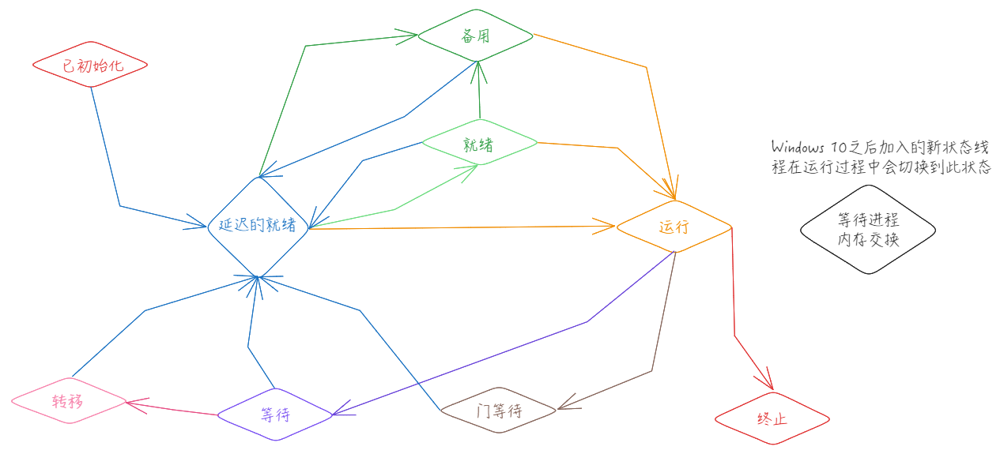

# Windows 进程

1. [进程结构体参考](./_PROCESS.md)
2. [线程结构体参考](./_THREAD.md)
## 进程结构体部分成员解释

**_KPROCESS**
- `DirectoryTableBase`  进程的页目录地址
- `ReadyListHead` 双向链表表头，记录了这个进程中处于就绪状态但尚未加入全局就绪的线程。当一个进程被换出到内存以后，它所属的线程一旦就绪，则被挂到此链表中，并要求换人该进程。当该进程被换人内存时，ReadyListHead中的所有线程被加人到系统全局的就绪线程链表中。注意, ReadyListHead链表中的每一项都是一个指向KTHREAD对象的WaitListEntry域的地址，所以，从链表中的每一项都可以定位到对应的线程对象。


## 进程创建过程

```c
NTSTATUS NTAPI *NtCreateProcessEx
(
    OUT PHANDLE     ProcessHandle,
    IN ACCESS_MASK  DesiredAccess,
    IN POBJECT_ATTRIBUTES ObjectAttributes  OPTIONAL,
    IN HANDLE   ParentProcess,
    IN ULONG    Flags,
    IN HANDLE SectionHandle     OPTIONAL,
    IN HANDLE DebugPort     OPTIONAL,
    IN HANDLE ExceptionPort     OPTIONAL,
    IN BOOLEAN  InJob
);
```
当应用程序通过`CreateProcess`来创建一个进程时，最终会调用ntdll.dll中的`NtCreateProcessEx`函数。

下面展示了几个参数含义：
- ProcessHandle  如果创建成功，则它包含了所创建的进程的句柄。
- DesiredAccess  包含了对新进程的访问权限。
- ObjectAtrbutes   一个可选的指针参数(意指可以为NULL),它指定了进程对象的属性。
- ParentProcess  指向父进程的句柄，必需的参数，不能为NULL。
- Flags  创建标志
- SectionHandle  个内存区对象，代表了该进程的映像文件。
- DebugPort   一个可选的句柄，指向一个端口对象，参数不为NULL,则此端口被赋为新进程的调试端口,否则,新进程没有调试端口。
- ExceptionPort  一个可选的句柄，指向一个端口对象，此端口被赋为新进程的异常端口，否则，新进程没有异常端口。

## 线程创建过程

```
NTSTATUS NTAPI *NtCreateThreadEx (
    OUT  PHANDLE ThreadHandle, 
    IN  ACCESS_MASK DesiredAccess, 
    IN  POBJECT_ATTRIBUTES ObjectAttributes OPTIONAL, 
    IN  HANDLE ProcessHandle,
    IN  PVOID StartRoutine,
    IN  PVOID Argument OPTIONAL,
    IN  ULONG CreateFlags,
    IN  ULONG_PTR ZeroBits, 
    IN  SIZE_T StackSize OPTIONAL,
    IN  SIZE_T MaximumStackSize OPTIONAL, 
    IN  PVOID AttributeList OPTIONAL
);
```

## 线程调度



```
0: kd> dt _KTHREAD_STATE
nt!_KTHREAD_STATE

// 已初始化( Initialized) :说明一个线程对象的内部状态已经初始化，这是线程创建
// 过程中的一个内部状态，此时线程尚未加人到进程的线程链表中，也没有启动。
   Initialized = 0n0

// 就绪(Ready) :代表该线程已经准备就绪，等待被调度执行。当线程调度器选择一
// 个线程来执行时，它只考虑处于就绪状态的线程。此时，线程已被加人到某个处理器
// 的就绪线程链表中。
   Ready = 0n1

// 运行( Running) :线程正在运行。该线程一 直占有处理器，直至分到的时限结束，
// 或者被一个更高优先级的线程抢占,或者线程终止,或者主动放弃处理器执行权，或
// 者进人等待状态。
   Running = 0n2

// 备用( Standby) :处于备用状态的线程已经被选中作为某个处理器上的下一个要运行
// 的线程。对于系统中的每个处理器，只能有一个线程可以处于备用状态。然而，一个
// 处于备用状态的线程在真正被执行以前，有可能被更高优先级的线程抢占。
   Standby = 0n3

// 已终止( Terminated ):表示线程已经完成任务,正在进行资源回收。KeTerminateThread
// 函数用于设置此状态。
   Terminated = 0n4

// 等待(Waiting) :表示一个线程正在等待某个条件，比如等待一个分发器对象变成
// 有信号状态，也可以等待多个对象。当等待的条件满足时，线程或者立即开始运行，
// 或者回到就绪状态。
   Waiting = 0n5

// 转移( Transition) :处于转移状态的线程已经准备好运行，但是它的内核栈不在内
// 存中。一旦它的内核栈被换入内存，则该线程进人就绪状态。
   Transition = 0n6

// 延迟的就绪( DeferredReady) :处于延迟的就绪状态的线程也已经准备好可以运行
// 了，但是，与就绪状态不同的是,它尚未确定在哪个处理器上运行。当调度器获得控制
// 权时，延迟就绪的链表中的线程被逐个处理。
   DeferredReady = 0n7

// 门等待( CateWait) :线程正在等待一个门对象。此状态与等待状态类似，只不过它
// 是专门针对门对象而设计。
   GateWaitObsolete = 0n8

// 等待进程交换(WaitingForProcessInSwap): 标明线程正在等待一个进程被换入或者换出
// 到内存。该状态是线程生命周期管理的一部分，依赖于内存管理和进程调度。
// 当线程处于该状态时，它被暂停，直到内存操作完成(比如进程内存的换入换出)。该状态确保
// 当进程没有被完全装载到内存之前线程不继续执行任何操作，从而避免潜在的错误与前后访问
// 不一致。
   WaitingForProcessInSwap = 0n9
```


```c
VOID
FASTCALL
KiReadyThread (
    IN PKTHREAD Thread
    )

/*++

Routine Description:

    This function inserts the specified thread in the process ready list if
    the thread's process is currently not in memory, inserts the specified
    thread in the kernel stack in swap list if the thread's kernel stack is
    not resident, or inserts the thread in the deferred ready list.

    N.B. This function is called with the dispatcher database lock held and
         returns with the lock held.

    N.B. The deferred ready list is a per processor list and items are
         only inserted and removed from the respective processor. Thus
         no synchronization of the list is required.

Arguments:

    Thread - Supplies a pointer to a dispatcher object of type thread.

Return Value:

    None.

--*/
```